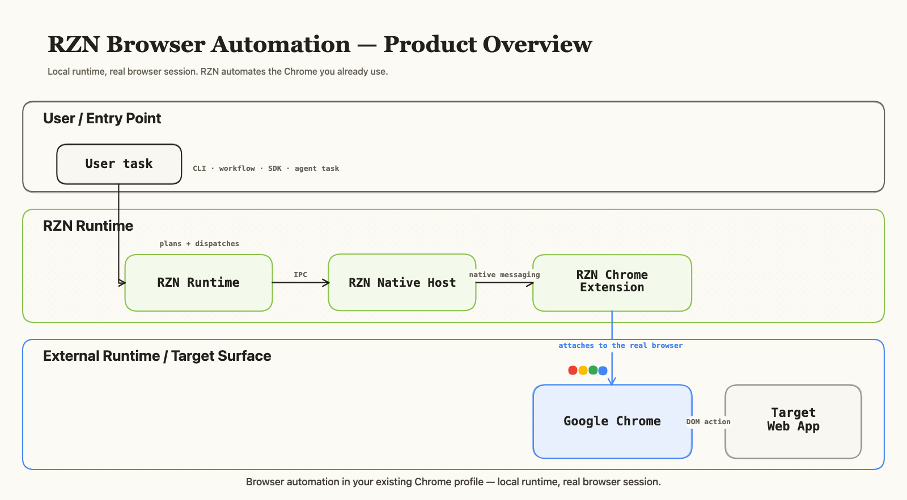
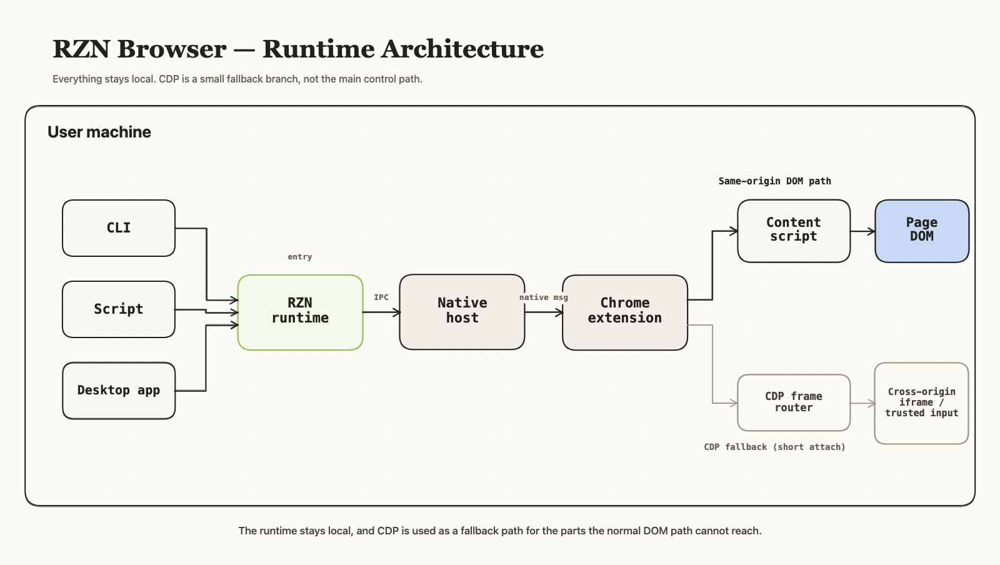
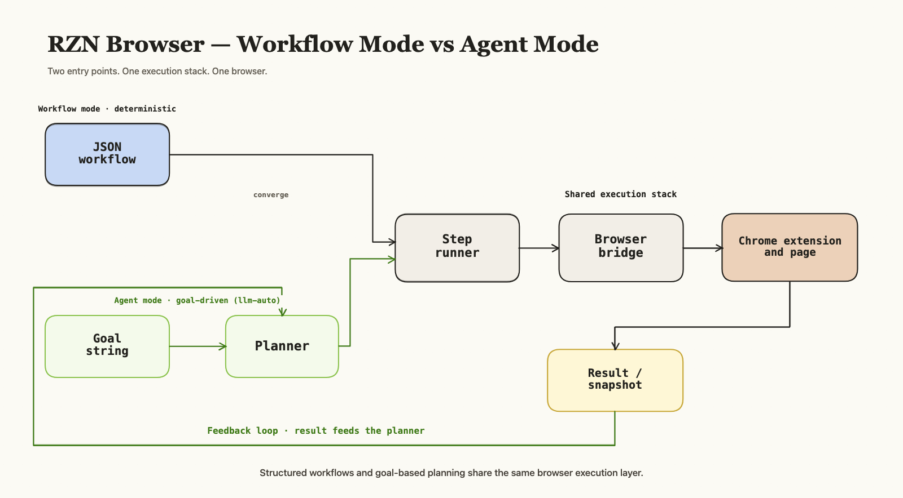

# RZN Browser

RZN Browser is a CLI-based browser automation tool. It can open websites, click buttons, fill forms, extract data, run repeatable workflows, or let an LLM drive and complete ambiguous browser tasks.

It runs page actions through a Chrome extension and falls back to CDP for harder cases. You can drive it from the CLI, from an MCP-based agent, or by running saved workflows directly.

RZN is strongest when you want a local browser tool with built-in workflow packs, not just a blank browser SDK.

<p>
  
</p>

## Workflow Packs

RZN ships with built-in workflow packs. For sites that need authentication, assume you are already signed in and use your normal browser session.

### Search & Research

| Icon | System | Capabilities |
| --- | --- | --- |
|  | Google | Search, Maps, News, Scholar, Images, Shopping, Trends, Flights, Hotels, Weather |
|  | Bing | Search, news, and image workflows |
|  | YouTube | Search and video discovery |
|  | PubMed | Search and paper extraction |
|  | arXiv | Search and preprint extraction |
|  | ScienceDirect | Search and paper access workflows |

### Shopping, Travel & Reviews

| Icon | System | Capabilities |
| --- | --- | --- |
|  | Amazon | Product search, key facts, and review extraction |
|  | Etsy | Listing search and review extraction |
|  | G2 | Product search, details, and review extraction |
|  | Capterra | Product search, details, and review extraction |
|  | App Store | App search, app details, and draft review flows |
|  | Airbnb | Search workflows |

### AI Apps

| Icon | System | Capabilities |
| --- | --- | --- |
|  | ChatGPT | New chats, continue chats, export chats, recent chats, image generation and downloads |
|  | Claude | Recent chats, replies, and full chat export |

### Social & Communities

| Icon | System | Capabilities |
| --- | --- | --- |
|  | X | Timeline reads, thread export, post drafts, likes, replies, inbox, and DMs |
|  | Reddit | Inbox, chats, comment flows, drafts, and replies |
|  | Hacker News | Submit, comment, reply, and draft-first write flows |
|  | Instagram | Profile posts and post asset extraction |

## Best Fit

- Local browser automation from the CLI or MCP
- Built-in workflow packs instead of starting from a blank SDK
- Repeatable browser tasks that you want to save and rerun
- LLM-driven browser tasks when the flow is still ambiguous
- Signed-in product surfaces like ChatGPT, Claude, X, Reddit, and Instagram

## Not For

- Cloud browser infrastructure
- Mainstream test automation
- Large-scale scraping fleets
- Teams looking for a general-purpose browser SDK first

## How It Works

<p>
  
</p>

- First path: use the extension and page actions.
- Second path: use CDP for the cases the first path cannot handle.
- Use fixed workflows when the task is known.
- Use `llm-auto` when the task is still fuzzy.

<p>
  
</p>

## Get Started in 10 Seconds

1. Install the native binaries:

```sh
# macOS / Linux
curl -fsSL https://raw.githubusercontent.com/srv1n/rzn-browser/main/install.sh | sh

# Windows PowerShell
irm https://raw.githubusercontent.com/srv1n/rzn-browser/main/install.ps1 | iex
```

2. Install the Chrome extension:

- Open `chrome://extensions`
- Enable `Developer mode`
- Click `Load unpacked`
- Pick the installed `extension/dist-chrome` directory

3. Optional but recommended: install the broad Agent Skill so LLMs can use workflows and `llm-auto` cleanly:

```sh
# Global install, linked into Codex, Claude Code, Gemini CLI, and generic Agent Skills paths.
rzn-browser skill install --global

# Or project-local install for the current repo.
rzn-browser skill install --project
```

For workflow authoring specifically, the narrower builder skill is still available:

```sh
bash scripts/install_rzn_workflow_builder_skill.sh --global
```

If you just want to prove it works, run:

```sh
rzn-browser list google
rzn-browser run google search --param search_query="browser automation"
```

## Prereqs

- Google Chrome
- A normal Chrome profile
- Developer mode enabled in `chrome://extensions` so you can load the unpacked extension
- `OPENAI_*` or `GEMINI_*` env vars only if you want `llm-auto`

You do not need:

- Playwright
- Selenium
- A separate CDP install
- A Chrome `--remote-debugging-port` setup
- Rust, Bun, or a local build toolchain unless you are building from source

## Repo Layout

If you are browsing the repository instead of just installing the product, this is the map:

| path | purpose |
| --- | --- |
| `crates/` | Rust runtime crates for the CLI, native host, worker, planner, and supporting systems |
| `extension/` | Chrome extension source, tests, and built browser payloads |
| `workflows/` | Shipped workflow catalog and workflow-specific docs/readmes |
| `scripts/` | Developer tooling, release scripts, guards, and agent utilities |
| `resources/` | Runtime metadata and connector assets such as browser system metadata and social card catalogs |
| `examples/` | Non-core examples, reference integrations, and experimental helpers |
| `bindings/` | Placeholder surface for external language bindings |
| `schema/` | Canonical JSON schemas used across runtime and extension codegen |
| `skills/` | Reusable workflow-oriented skill packs and wrappers |
| `docs/` | Architecture notes, feature scratchpads, visual briefs, and workflow docs |
| `test/` + `tests/` | Manual harnesses, fixtures, and automated tests |

## Installation

Install from the latest GitHub release first. Source installs belong in developer setup, not the first-run path.

```sh
# latest GitHub release on macOS/Linux
curl -fsSL https://raw.githubusercontent.com/srv1n/rzn-browser/main/install.sh | sh

# latest GitHub release on Windows
irm https://raw.githubusercontent.com/srv1n/rzn-browser/main/install.ps1 | iex
```

The installer drops the runtime into a stable local directory, installs the native host, refreshes the built-in workflow catalog, and exposes the CLI binaries on your machine.

| OS | runtime root | what lands there |
| --- | --- | --- |
| macOS | `~/Library/Application Support/RZN` | `bin/`, `extension/dist-chrome/`, `workflows/` |
| Linux | `~/.local/share/RZN` | `bin/`, `extension/dist-chrome/`, `workflows/` |
| Windows | `%LOCALAPPDATA%\\RZN` | `bin\\`, `extension\\dist-chrome\\`, `workflows\\` |

- Runtime binaries installed by the bundle: `rzn-browser`, `rzn-browser-worker`, `rzn-native-host`
- On macOS/Linux the installer also places PATH-facing binaries in `~/.local/bin` or `~/bin` when available.
- On Windows it installs into `%LOCALAPPDATA%\\RZN\\bin` and adds that directory to the user PATH.
- The installer also writes the Chrome native messaging registration for you.
- Chrome already includes CDP support. You are not installing CDP separately.

## Chrome Setup

This is the one manual browser step.

1. Open `chrome://extensions`.
2. Enable Developer mode.
3. Click `Load unpacked`.
4. Pick the installed `extension/dist-chrome` directory.

Use these stable paths:

- macOS: `~/Library/Application Support/RZN/extension/dist-chrome`
- Linux: `~/.local/share/RZN/extension/dist-chrome`
- Windows: `%LOCALAPPDATA%\\RZN\\extension\\dist-chrome`

After the first load, restart Chrome once.

## First Run

You can call shipped workflows by namespace instead of file path:

- `rzn-browser run google search`
- `rzn-browser run google/search`

Both resolve through the installed workflow catalog.

Example first run:

```sh
rzn-browser list google
rzn-browser run google search --param search_query="browser automation"
```

That should open Google in your existing Chrome session, run the packaged search workflow, and return extracted results.

If you want the same runtime to go autonomous instead of following a fixed workflow:

```sh
rzn-browser llm-auto "Search Google for browser automation and extract the top results"
```

## Workflow Catalog

| icon | system name | workflows |
| --- | --- | --- |
|  | Google | Search and related flows under `google/*` |
|  | Bing | Search/image-style flows under `bing/*` |
|  | Hacker News | Read, draft, and comment flows under `hn/*` |
|  | Instagram | Profile/post asset flows under `instagram/*` |
|  | X | Session-aware extraction flows under `x/*` |
|  | ChatGPT | ChatGPT web app flows under `chatgpt/*` |
|  | Examples | Packaged examples under `examples/*` |

Useful commands:

- `rzn-browser list`
- `rzn-browser list google`
- `rzn-browser list chatgpt continue-chat-v1`
- `rzn-browser list --source builtin`
- `rzn-browser list google --all-sources`
- `rzn-browser list --source user -v`
- `rzn-browser workflow list`
- `rzn-browser workflow list google`
- `rzn-browser workflow show chatgpt send`
- `rzn-browser workflow validate workflows/chatgpt/chatgpt_send.json`
- `rzn-browser workflow validate workflows/chatgpt/chatgpt_send.json --write-help`
- `rzn-browser workflow pull`
- `rzn-browser workflow add ~/Downloads/my-flow.json --system custom --name my-flow`

`rzn-browser list` is the short top-level alias for catalog inspection. `workflow list` still works.

Use progressive disclosure:

- `rzn-browser list <system>` keeps the output compact.
- `rzn-browser list <system> <workflow>` shows the detailed help view for one workflow: what it does, required and optional params, and a runnable example command.
- `rzn-browser workflow show <system> <workflow>` shows the same detailed help view.
- `rzn-browser workflow validate <path-or-id>` checks that the workflow and its help metadata are in sync.
- `rzn-browser workflow validate <path-or-id> --write-help` scaffolds or refreshes the top-level `help` block before validating.

List output defaults to the effective workflow per id. Use the extra flags when you need to inspect collisions or origins:

- `--source user|builtin|legacy`: only show entries from that catalog source
- `--all-sources`: include shadowed entries instead of only the winning one
- `-v`, `--verbose`: show ids, legacy aliases, relative paths, and resolved file paths

## Create Your Own Workflows

The fastest path is:

1. Start from an existing workflow that is close to what you want.
2. Run it against your real browser session.
3. Edit the JSON until the flow is stable.
4. Import it into your local catalog.

Useful commands:

```sh
# inspect the shipped packs
rzn-browser list
rzn-browser list google
rzn-browser list chatgpt send
rzn-browser workflow validate workflows/chatgpt/chatgpt_send.json

# run a built-in workflow
rzn-browser run google search --param search_query="browser automation"

# import your own workflow into the local user catalog
rzn-browser workflow add ~/Downloads/my-flow.json --system custom --name my-flow

# run your imported workflow
rzn-browser run custom my-flow
```

Recommended local loop:

- Start from a nearby JSON in `workflows/<system>/`.
- Keep site-specific selectors and page logic inside the workflow JSON, not in shared engine code.
- Prefer the installed workflow ids like `google search` over repo-relative file paths once the flow is good enough to reuse.
- Add a `help` block for every new workflow so the CLI can explain params and examples without guessing.
- Run `rzn-browser workflow validate <path> --write-help` while authoring. It fills in the boring param docs and then tells you what still needs a human pass.
- If you want the agent to discover a flow first, use `llm-auto` and save the resulting workflow JSON, then clean it up into a deterministic workflow.

Useful references:

- `workflows/README.md` for the shipped catalog layout
- `docs/BROWSER_DEV_LOOP.md` for the workflow factory / save-workflow dev loop
- `docs/workflows/README.md` for the docs structure used by built-in packs
- `rzn-browser skill install --global` if you want an Agent Skill for direct workflow and `llm-auto` use
- `rzn-browser skill update --global` to refresh installed skill links after a release or git checkout update
- `rzn-browser skill remove --global` to remove the managed skill and its symlinks
- `scripts/install_rzn_workflow_builder_skill.sh` if you want to install the narrower workflow-builder skill

## Submit Workflows Back To The Repo

If you want to contribute a workflow pack back upstream, follow this shape:

1. Add the workflow JSON under `workflows/<system>/`.
2. Add or update the docs under `docs/workflows/<system>/`.
3. Keep shared engine code generic. Site-specific selectors belong in the workflow pack.
4. Add a clear example command with required `--param` values.
5. Mention whether the flow is read-only, draft-only, or performs a real write action.

Good submissions usually include:

- One canonical workflow filename per workflow
- A short system README in `docs/workflows/<system>/README.md`
- One markdown doc per workflow under `docs/workflows/<system>/`
- Parameters, output shape, and a runnable example
- A focused validation path, parse test, or smoke workflow when the change is non-trivial

The easiest way to get a workflow accepted is to keep the value obvious:

- one system
- one concrete user outcome
- deterministic steps
- no site-specific hacks in shared runtime code

## Example Flows

- Search and extract results from Google, Bing, or YouTube.
- Reuse a logged-in session on X, Reddit, ChatGPT, Instagram, or Hacker News.
- Interact with UI inside embedded cross-origin frames without swapping tools.
- Draft comments or messages for review before submit.
- Mix deterministic workflows with agent-style tasks in the same browser runtime.

## Integrations

- `Chrome + native messaging host`: local bridge into the browser without launching a separate automation browser
- `Workflow catalog`: built-in flows ship with the runtime; your own JSON flows live alongside them
- `LLM providers`: use `OPENAI_*` or `GEMINI_*` env vars for `llm-auto`, or `LLM_PROVIDER=dummy` for deterministic local runs
- `RZN desktop/runtime`: the standalone CLI can coexist with the same browser-side connection instead of stealing it

## For Design

If the downstream team is turning this into visuals, use [docs/README_VISUAL_BRIEFS.md](docs/README_VISUAL_BRIEFS.md). It includes copy-pasteable write-ups for the product story, runtime architecture, action escalation, and workflow-versus-agent flow.

## Build From Source

```sh
cargo build --release -p rzn-browser -p rzn-browser-worker -p rzn-native-host
cd extension && bun install && bun run build
```

## Developer Setup

If you are working from the repo instead of trying the product, use:

```sh
make install
```

That builds the local runtime, installs the native host, copies the stable extension payload, and refreshes the bundled workflow catalog.

If you are building from source, you need:

- Rust toolchain / Cargo
- Bun for the extension build
- Google Chrome for loading the unpacked extension

For deeper setup and architecture details, see [docs/BROWSER_DEV_LOOP.md](docs/BROWSER_DEV_LOOP.md), [docs/ARCHITECTURE.md](docs/ARCHITECTURE.md), and [docs/REPO_MAP.md](docs/REPO_MAP.md).

## License

GNU AGPLv3 (`AGPL-3.0-only`). See [LICENSE](LICENSE).
