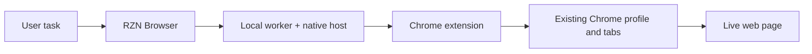
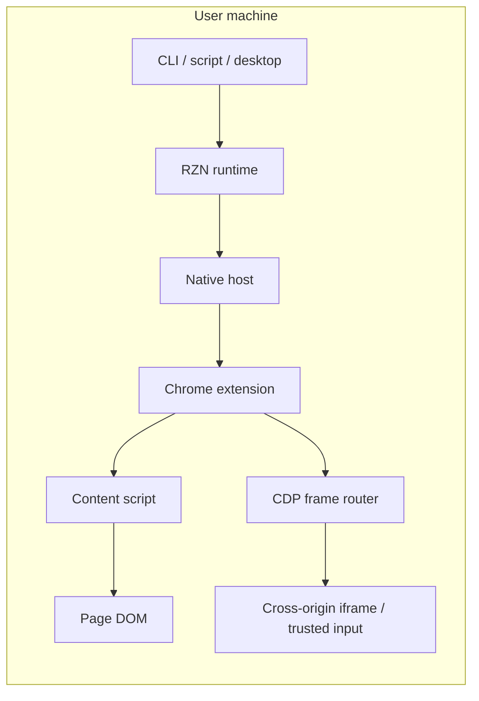
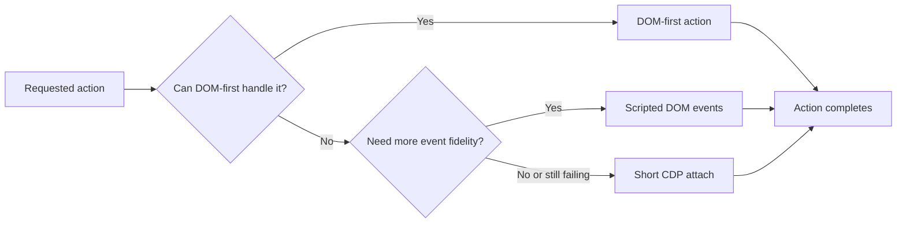
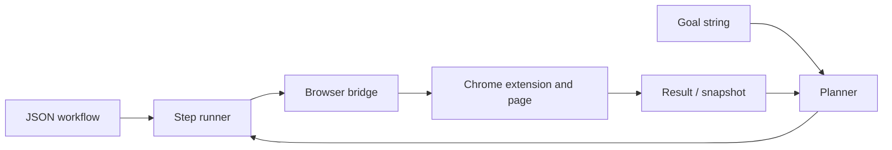

# README Visual Briefs

These are copy-paste briefs for anyone turning RZN Browser into diagrams, landing-page graphics, or product visuals.

Keep the story honest:

- This is local browser automation.
- It runs in a real Chrome session.
- It is not a cloud browser farm.
- It is not a separate bot browser with a nicer logo.

## Visual 1: Product Overview

**What it should communicate**

RZN Browser automates the browser you already use.

**What to show**

- A user sends a command, workflow, or natural-language task.
- RZN routes it locally.
- The Chrome extension executes against the user's existing Chrome profile and tabs.
- The result comes back to the user.

**Do not imply**

- A separate automation browser window
- Remote browsers or proxy infrastructure
- CDP as the default control path

**Caption**

"RZN Browser drives your existing Chrome session through a local extension and native host."

## Visual 2: Runtime Architecture

**What it should communicate**

Everything stays on the user's machine. CDP exists as a branch for hard cases, not as the whole product.

**What to show**

- Entry points can be CLI, script, or desktop app.
- The runtime passes through the native host into the extension.
- Same-origin actions route through the content script.
- Cross-origin or trusted-input cases can route through the CDP frame layer.

**Do not imply**

- A server in the middle
- A browser launched by a test framework
- Site-specific adapters hard-coded per domain

**Caption**

"The runtime stays local, and CDP is used as a fallback path for the parts the normal DOM path cannot reach."

## Visual 3: Action Escalation

**What it should communicate**

RZN does not jump straight to the heaviest control path. It starts light and escalates only when the page forces it to.

**What to show**

- Same-origin DOM actions first
- Scripted event fallback second
- Short CDP attach last
- Cross-origin iframes, trusted input, and stubborn UI are the reasons for escalation

**Caption**

"RZN uses the lightest path that works, then drops into CDP only for hard cases."

## Visual 4: Workflow Mode vs Agent Mode

**What it should communicate**

There are two entry points, but one execution stack.

**What to show**

- JSON workflow path for deterministic automation
- `llm-auto` path for goal-driven automation
- Both converge into the same step runner and browser bridge
- Results and snapshots feed the planner when the agent loop is active

**Caption**

"Structured workflows and goal-based planning share the same browser execution layer."

## Visual Notes

| Theme | Keep | Avoid |
| --- | --- | --- |
| Browser depiction | The user's real Chrome window and tabs | A fresh automation browser or anonymous test window |
| Runtime depiction | Local machine, local extension, local bridge | Cloud browser grid, scraper fleet, proxy tunnel art |
| Tone | Productive operator tooling | Generic growth-hack bot aesthetics |
| CDP depiction | Small fallback branch | Giant control plane that suggests CDP is always on |

## Copy Snippets

- "Automate the Chrome session you already use."
- "Keep the browser normal. Change the control path."
- "Start with DOM. Escalate only when the page forces it."
- "One runtime, two entry points: workflows and goal-based tasks."
