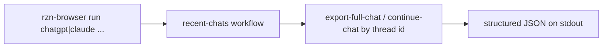

# Assistant Conversation Sync

## Overview
- Goal: provide an inbox-style workflow pack for ChatGPT and Claude so the operator can pull recent chats, export each transcript, and resume a tracked conversation with a reply — all through the `rzn-browser` binary.
- Constraints: the workflow CLI is the only orchestration surface. Reuse the authenticated Chrome profile, keep app-specific DOM logic in workflow JSON, and avoid engine-level site special-casing.

## Flow Diagrams
- End-to-end sync



- Reply / update loop

```text
rzn-browser run chatgpt continue-chat-v1 --param chat_id=... --param message_text=...
  -> rzn-browser run chatgpt export-full-chat-v1 --param chat_id=...
  -> caller inspects the returned transcript to decide next action
```

- Direct single-thread fetch

```text
rzn-browser run chatgpt export-full-chat-v1 --param chat_id=...
  -> one structured JSON payload (transcript + assets) on stdout
```

## Decision Record
- Use dedicated-tab export/list flows for inbox sync. Existing-session behavior can be useful for one-off manual sends, but it is the wrong shape for batch export or parallel fanout.
- ChatGPT sync should use session-owned workflow tabs and preserve `session_id` + `current_tab_id` across follow-up calls. Earlier current-tab validation was a stopgap, not a catalog pattern.
- Keep app-specific DOM logic in workflow JSON. ChatGPT and Claude are fast-moving SPAs; baking their selectors into shared Rust or extension code would be expensive to maintain.
- The first-class unit is a CLI workflow invocation with explicit params. Local artifact persistence, index management, and waiting-state tracking are caller responsibilities — there is no shipped Python helper.
- Reuse existing ChatGPT single-thread send flows for replies; add new dedicated-tab read/export surfaces for inbox-style work.

## Architecture
- Workflows (invoked directly through the binary):
  - `workflows/chatgpt/chatgpt_recent_chats_v1.json` — `rzn-browser run chatgpt recent-chats-v1 --param limit=... --param days=...`
  - `workflows/chatgpt/chatgpt_export_full_chat_v1.json` — `rzn-browser run chatgpt export-full-chat-v1 --param chat_id=...`
  - `workflows/chatgpt/chatgpt_continue_chat_v1.json` — `rzn-browser run chatgpt continue-chat-v1 --param chat_id=... --param message_text=...`
  - `workflows/chatgpt/chatgpt_get_response_v1.json` — `rzn-browser run chatgpt get-response-v1 --param chat_id=...` for the latest assistant turn only
  - `workflows/chatgpt/chatgpt_download_attachment_v1.json` — `rzn-browser run chatgpt download-attachment-v1 --param chat_id=... --param attachment_label=...`
  - `workflows/claude/claude_recent_chats.json` — `rzn-browser run claude recent-chats`
  - `workflows/claude/claude_export_chat.json` — `rzn-browser run claude export-chat --param thread_id=...`
  - `workflows/claude/claude_send.json` — `rzn-browser run claude send --param thread_id=... --param message_text=...`
- Output contract:
  - Each invocation prints one structured JSON payload to stdout. Transcripts include per-turn `text` and reconstructed `markdown`; ChatGPT's full export also returns `assets.files` and `assets.images`.
  - Asset downloads (button-backed attachments, generated images) land in the active Chrome profile's Downloads folder, or in a workflow-supplied `download_folder` for image flows.
  - JSON/Markdown/JSONL persistence, run manifests, resume cursors, and `waiting_state` tracking are caller responsibilities — compose them in your own runner from the binary's stdout.

## Implementation Notes
- Recent-chat workflows return a normalized `thread_id` plus app-specific fields like `chat_id` where that already exists.
- Export workflows scroll toward the top before extracting the transcript so older turns have a better chance to load.
- ChatGPT full-thread export aggregates thread assets into `assets.files` and `assets.images`, plus per-turn asset references where the DOM exposes them.
- ChatGPT button-backed attachments use `chatgpt_download_attachment_v1.json`. It scopes to the latest assistant turn and clicks an exact visible label instead of poking page-wide buttons.
- Live validation on April 16, 2026 confirmed the three-way mapping:
  - `Self-contained HTML manual` → `.html`
  - `Markdown source` → `.md`
  - `Zip package with Markdown + extracted figure assets` → `.zip`
- ChatGPT thread-opening prefers direct `navigate_to_url` into `/c/{chat_id}`. A same-tab JS redirect looked clever and turned out flaky under the native host.
- ChatGPT recent-chat discovery uses a synchronous localStorage + sidebar DOM merge after the earlier async polling version hit `Runtime.evaluate` timeouts.
- ChatGPT chat IDs accept either bare UUIDs or full `https://chatgpt.com/c/<id>` URLs in `--param chat_id=...`; the binary normalizes either form.
- For "newest assistant/user message" use cases: run `export-full-chat-v1` (or `get-response-v1` for assistant-only) and pick the matching tail entry from the returned transcript. There is no separate `latest` subcommand.
- For "waiting state" derivation: take the last exported turn — `user` → `awaiting_assistant`, `assistant` → `awaiting_user`. Compute it in the caller, not the binary.
- Claude sync can fan out across isolated workflow tabs.
- ChatGPT sync is sequential until the dedicated-tab path is fully revalidated end to end.

## Tasks & Status
- [x] Add recent-chat discovery for ChatGPT
- [x] Add full-chat export for ChatGPT
- [x] Add recent-chat discovery for Claude
- [x] Add full-chat export for Claude
- [x] Add reply flow for Claude
- [x] Remove the Python helper layer; promote sync/fetch/reply/latest to direct binary invocations
- [x] Add workflow docs and parse coverage
- [x] Add auth-required guards for ChatGPT and Claude export flows
- [x] Re-validate ChatGPT after Chrome extension/native-host reconnect and move the catalog back to dedicated workflow tabs
- [ ] Validate Claude pack against a live authenticated session
- [ ] Improve ChatGPT transcript deduplication for transient wrapper turns
- [x] Add a button-backed ChatGPT attachment workflow for latest-assistant artifacts
- [ ] Tighten Claude message-root and send-button heuristics with live DOM evidence
- [ ] Promote ChatGPT attachment download completion into a first-class CLI-visible manifest instead of external Downloads-folder diffing

## What Works (Do Not Change)
- Deterministic per-thread workflows callable directly from the `rzn-browser` binary.
- Workflow-level ChatGPT thread operations keyed by `chat_id`.
- The binary's stdout JSON contract — callers build whatever index/state they need on top of it.

## Tried & Didn’t Work
- Shipping a Python orchestration wrapper (`scripts/assistant_conversation_sync.py`). Added a hidden control surface that drifted from the binary; removed in favor of direct CLI calls.
- Extending existing-session single-thread workflows into a batch sync surface. Kills parallelism and makes stateful fanout miserable.
- Treating transcript export as "whatever is visible right now." Too weak — export flows now attempt upward scrolling before extraction.
- Redirecting ChatGPT with `execute_javascript` after first landing on `/`. Inconsistent timeouts and blank-shell reads under the native-host path; direct route navigation is the better call.
- Polling ChatGPT recent-history state inside one long async `execute_javascript` block. Hit `Runtime.evaluate` timeouts; a synchronous merge is simpler and more reliable.
- Earlier dedicated/background ChatGPT tabs were flaky in one Chrome session, which caused a temporary active-tab workaround. That workaround is no longer an acceptable catalog pattern; preserve `session_id` + `current_tab_id` instead.
- Treating ChatGPT attachments like normal anchors. On real threads, the important artifacts were button-backed actions in the latest assistant turn, so share menus and page-wide button scans were the wrong approach.
