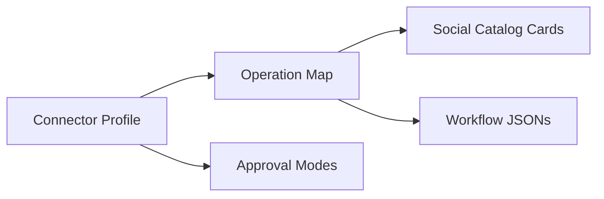

# Browser Social Contract

## Overview
- Goal: define a browser-side connector contract that mirrors the downstream social-profile idea, so every new browser social connector ships with one canonical catalog, one connector profile, and one full set of expected operations.
- Constraints: the browser runtime reuses a live authenticated session instead of device automation; approval semantics must be explicit because some operations are mutating; the contract should stay connector-agnostic and should not encode site-specific selectors.

## Flow Diagrams
- Contract shape


- Mutating operation flow
```text
browser social profile
  -> operation entry
  -> canonical workflow
  -> request_user_intervention approval_mode
  -> continue, notify-and-stop, auto-continue, or noop-stop
```

## Decision Record
- Chosen: add a dedicated schema at `schema/browser-social-profile-v1.json` rather than overloading the existing social-card catalog. The catalog answers "what can run"; the profile answers "what a browser connector must provide."
- Chosen: require the same nine canonical social operations across connectors so parity is structural, not informal.
- Chosen: keep approval policy in the profile and in workflow steps. The profile defines the connector-level capability set; the workflow step defines the per-run behavior.
- Rejected: hiding approval behavior only in documentation. That would be non-executable and easy to drift from the runtime.

## Architecture
- Schema
  - `schema/browser-social-profile-v1.json`
  - Defines connector metadata, approval modes, and the required nine operations.
- Connector instance
  - `resources/cards/social/x_browser_profile_v1.json`
  - Declares X as a `browser_session_reuse` connector and binds each required operation to one canonical workflow.
- Related runtime contract
  - `request_user_intervention` now supports `approval_mode`, `continue_on_timeout`, and notification metadata.

## Implementation Notes
- Required operations:

| Contract op | Expected outcome |
| --- | --- |
| `daily_scroll` | Read timeline/feed digest |
| `open_post` | Open one post and return state |
| `like_post` | Mutate like state |
| `reply_post` | Draft and optionally send a reply |
| `create_post` | Draft and optionally send a new post |
| `open_inbox` | Open messaging inbox |
| `open_dm_thread` | Open one DM thread |
| `send_dm` | Draft and optionally send a DM |
| `reply_dm` | Draft and optionally send a DM reply |

- Approval modes:

| Mode | Behavior |
| --- | --- |
| `ask_user` | Show the in-page approval UI and wait |
| `notify` | Send a browser notification and stop the workflow |
| `auto_continue` | Skip approval and continue immediately |
| `noop` | Stop cleanly without UI or notification |

- The runner also supports environment overrides for `request_user_intervention`:
  - `RZN_APPROVAL_MODE`
  - `RZN_INTERVENTION_POLICY`
  - `RZN_CONTINUE_ON_TIMEOUT`
  - `RZN_APPROVAL_CONTINUE_ON_TIMEOUT`

## Tasks & Status
- [x] Define the browser social profile schema
- [x] Add an X connector profile instance
- [x] Formalize approval modes for `request_user_intervention`
- [x] Add runtime override hooks for approval mode and timeout behavior
- [ ] Add equivalent profiles for other browser social connectors as they land

## What Works (Do Not Change)
- Keep catalogs and connector profiles separate.
- Keep the nine required operations stable across browser connectors.
- Keep approval behavior runtime-configurable so the same workflow can operate in safe-review or YOLO modes.

## Tried & Didn’t Work
- Treating the social-card catalog alone as the browser connector contract. It does not encode auth model, approval capabilities, or the connector-wide required-op checklist.
- Treating `request_user_intervention` as a pure UX banner. That was not a real approval contract because timeout implicitly continued the workflow.
