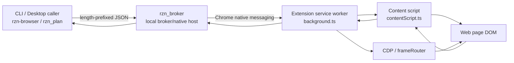
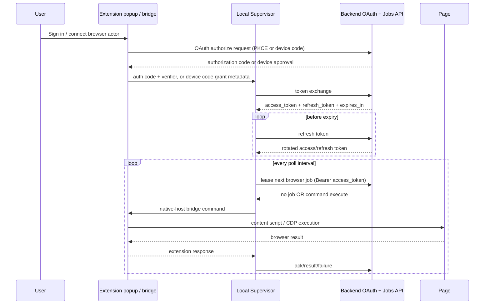
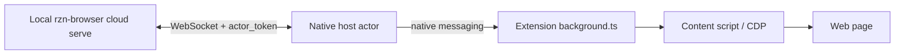
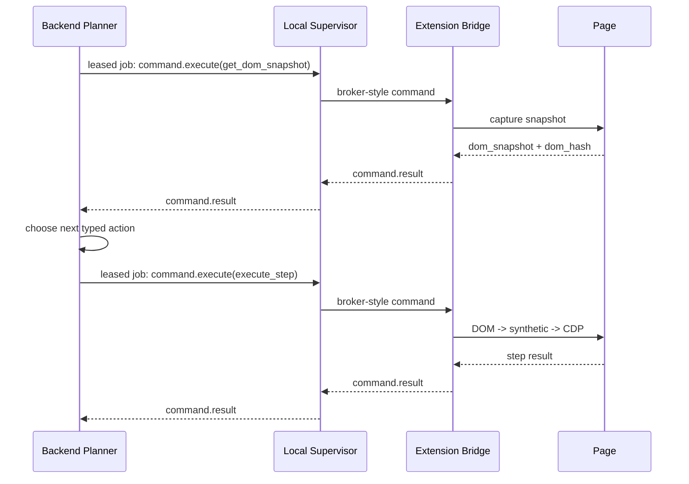
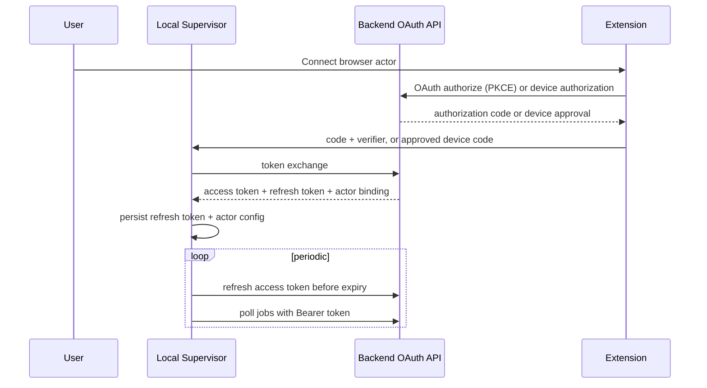

# Cloud Control Plane

## Overview
- Goal: move orchestration, scheduling, and LLM planning to the backend, while a **local supervisor daemon** remains the durable device-side actor and the extension remains the typed browser executor inside the user's real Chrome session.
- Related runtime architecture: `docs/features/local_supervisor_runtime/README.md` is the first-class local topology for CLI, MCP, Reason app, and cloud producers.
- Product outcome: the backend can dispatch workflows to an OAuth-authenticated browser actor, receive snapshots/results, and run multi-step autonomous loops without the CLI being the primary runtime entrypoint.
- Technical posture: use backend-supported OAuth for device/user auth, preserve the existing execution contract surface (`StepKind`, extraction plans, snapshots, CDP escalation), avoid arbitrary remote code execution, and keep browser interaction auditable.
- Constraints:
  - No local or RZN-side control-plane server should be required for the product path. The installed actor makes outbound HTTPS requests only.
  - Chrome native messaging is local-only. The backend cannot literally become the native host.
  - MV3 service workers are suspendable. They are not strong enough to be the canonical long-lived device actor.
  - Browser execution must remain typed and policy-gated.
  - Existing local workflows and broker-driven operation must keep working during migration.

- Non-goals:
  - No generic remote shell on the machine.
  - No arbitrary JavaScript as the primary remote execution mechanism.
  - No second browser automation stack for the main path. Playwright/WebDriver remain test-only or explicit break-glass tools.
  - No site-specific targeting logic.
  - No always-on inbound listener, local callback server, or WebSocket requirement for the installed actor.

## Flow Diagrams
- Current local-first flow


- Target outbound OAuth + polling flow


- Legacy dev harness, not canonical product auth


- Planner loop in the target architecture


- Control split
```text
Backend owns:
  - account/workspace auth
  - run scheduling and queueing
  - LLM planning and policy defaults
  - lease/retry decisions at the run level
  - durable run state and telemetry aggregation

Local supervisor owns:
  - OAuth token exchange, refresh, and local credential storage
  - outbound job polling and backoff
  - command spooling, dedupe, and redelivery coordination
  - extension reachability and recovery
  - native / OS capabilities

Extension owns:
  - browser session and tab affinity
  - DOM snapshots, observe, extraction plans
  - deterministic typed step execution
  - DOM -> synthetic -> CDP escalation
  - browser-side policy enforcement
```

## Decision Record
- The backend is the control plane, not the native host. Native messaging is a browser-to-local-process channel, so the correct long-term topology is `backend job API -> local supervisor -> extension -> page`.
- OAuth + outbound polling is the product transport. Pairing codes and WebSockets are useful dev scaffolding, but the installed browser actor should not require a server owned by this repo or an inbound listener on the user's machine.
- Refresh tokens live in the supervisor credential store, not in extension storage. The extension can initiate the browser-visible OAuth flow, but the supervisor owns the long-lived secret and refresh loop.
- The local supervisor daemon is the canonical device actor. It is a better fit than an MV3 service worker for long-lived connectivity, buffering, and secret storage.
- The extension remains the browser bridge and executor. `background.ts` already owns tab/session/CDP routing, and `contentScript.ts` already owns the execution surface.
- The backend reuses the existing typed action model rather than inventing a new browser DSL. We should anchor on `rzn_core::StepKind` and `rzn_contracts::v1`.
- `rzn_broker` should evolve, not be replaced. Its core job changes from "CLI transport endpoint" to "durable local supervisor and bridge adapter."
- Extension-direct mode is useful for low-friction onboarding and browser-only scenarios, but it should be treated as a lite mode with reduced guarantees.

## Architecture
- Canonical component map

| Layer | Responsibility | Current anchor | Target state |
| --- | --- | --- | --- |
| Backend API | OAuth auth, actor registration, run CRUD | none | backend service |
| Backend dispatch | queueing, polling leases, run assignment | none | backend service |
| Backend planner | LLM loops, retries, policy defaults | `crates/rzn_plan` | rehosted service |
| Local supervisor | durable device actor, OAuth refresh, polling, spool, native capabilities | native-host cloud loop / broker endpoint hints | `rzn-browser supervisor` |
| Extension bridge | browser transport, workflow tab/session routing, CDP leases | `extension/src/background.ts` | preserved and refactored |
| Content executor | snapshots, observe, extraction, action ladder | `extension/src/contentScript.ts` | preserved |
| Typed contracts | action/snapshot/result model | `crates/rzn_contracts` | preserved and extended |
| SDK/session model | host-facing deterministic actor surface | `crates/rzn_sdk` | adapted for cloud client/server usage |

- Canonical deployment topology

| Deployment unit | Runs where | Must persist | Notes |
| --- | --- | --- | --- |
| Backend control plane | hosted infra | accounts, OAuth clients/grants, actors, runs, command leases, telemetry | multi-tenant |
| Local supervisor daemon | user machine | OAuth refresh token, actor registration, command spool, last-known extension state | installed binary/service |
| Extension | user Chrome profile | tab/session affinity hints, non-secret actor metadata, feature flags | MV3 |
| Content scripts | target pages | ephemeral page-local state only | reinjected as needed |

- Repo/module mapping

| Repo path | Current purpose | Spec direction |
| --- | --- | --- |
| `crates/rzn_browser/src/cloud.rs` | dev-harness cloud control plane CLI/server | keep as local harness for pairing, fake dispatcher, and direct command smoke |
| `crates/rzn_browser/src/supervisor_cloud.rs` | supervisor-owned dev-harness actor lifecycle, config/status, WebSocket actor connection, command dedupe, and bridge dispatch | current local actor owner; OAuth polling mode still needs durable spool/token refresh |
| `crates/rzn_native_host/src/cloud.rs` | compatibility status/config shape for extension controls | no longer starts the actor loop; native-host controls forward to supervisor when available |
| `rzn_broker/src/main.rs` | broker/native host legacy path | preserve as compatibility only; new authority is supervisor handshake |
| `rzn_broker/src/protocol.rs` | broker/extension messages | preserve as local bridge protocol; do not force cloud to speak a different browser DSL |
| `extension/src/background.ts` | native host connection + routing | refactor into `transport adapters` + `command executor` + `session store` |
| `extension/src/contentScript.ts` | execution surface | preserve as-is except for command/result metadata improvements |
| `crates/rzn_plan/*` | local orchestration | extract/rehost planning logic into cloud planner services |
| `crates/rzn_contracts/src/v1.rs` | typed action/snapshot/result schema | become the stable cloud-facing action contract baseline |
| `crates/rzn_sdk/*` | host-side deterministic SDK | split into local SDK and cloud client SDK later |

- Capability model

| Capability | Source | Used for |
| --- | --- | --- |
| `extension_actor` | extension | deterministic browser steps |
| `cdp_available` / `cdp_enabled` / `cdp_attached` | extension | trusted input, cross-frame rescue |
| `native_input` | supervisor | OS-level input when browser ladder is insufficient |
| `local_files` | supervisor | file resolution/uploads/download handling |
| `desktop_prompts` | supervisor | human confirmations, notifications |
| `local_llm` | supervisor optional | future fallback/planner rescue mode |

- Runtime identities

| Entity | Cardinality | Purpose |
| --- | --- | --- |
| Workspace | many actors | tenant boundary |
| Actor | one installed device supervisor | cloud-addressable device identity |
| Browser session | one Chrome profile/extension binding | device-local browser availability |
| Run | one workflow execution | server-side orchestration record |
| Session | logical browser automation context within a run | tab affinity + dom hash continuity |
| Command | one executable typed unit | leased and idempotent |

- Data model
```text
Actor
  actor_id
  workspace_id
  display_name
  status { online, offline, degraded, blocked }
  capabilities
  version
  oauth_subject
  connected_at
  last_seen_at
  heartbeat_expires_at

Run
  run_id
  workspace_id
  actor_id
  planner_mode { deterministic, llm_server, llm_hybrid }
  requested_by
  status { queued, assigned, running, blocked, completed, failed, canceled }
  input
  created_at
  updated_at

Session
  session_id
  run_id
  actor_id
  current_tab_id
  current_url
  dom_hash
  extension_session_version
  state { pending, active, recovering, closed }

Command
  command_id
  run_id
  session_id
  lease_owner_actor_id
  lease_expires_at
  attempt
  dedupe_key
  payload
  status { queued, leased, acked, completed, failed, expired }
```

## Data Contracts
- Contract baseline
  - Reuse `rzn_contracts::v1` for typed browser actions and results.
  - Keep broker/local extension messages compatible with the current `cmd`/`req_id`/`payload` shape.
  - Introduce a backend job envelope around the existing local action payloads rather than replacing them.

- OAuth actor config stored by the local supervisor
```json
{
  "version": "rzn.cloud.actor_config.v2",
  "mode": "oauth_poll",
  "server_url": "https://cloud.rzn.ai",
  "workspace_id": "workspace_123",
  "actor_id": "actor_abc",
  "client_id": "rzn-browser-extension",
  "token_url": "https://cloud.rzn.ai/oauth/token",
  "jobs_url": "https://cloud.rzn.ai/v1/browser-actors/jobs/lease",
  "results_url": "https://cloud.rzn.ai/v1/browser-actors/jobs/results",
  "poll_interval_ms": 5000,
  "access_token": "short-lived",
  "refresh_token": "rotating-long-lived",
  "access_token_expires_at_ms": 1710000000000
}
```

- OAuth token exchange
```http
POST /oauth/token
content-type: application/x-www-form-urlencoded

grant_type=authorization_code
&client_id=rzn-browser-extension
&code=...
&code_verifier=...
&redirect_uri=https://<extension-id>.chromiumapp.org/rzn-browser
```

- OAuth refresh
```http
POST /oauth/token
content-type: application/x-www-form-urlencoded

grant_type=refresh_token
&client_id=rzn-browser-extension
&refresh_token=...
```

- Job lease poll
```http
POST /v1/browser-actors/jobs/lease
authorization: Bearer <access_token>
content-type: application/json

{
  "actor_id": "actor_abc",
  "capabilities": {
    "extension_actor": true,
    "cdp_available": true,
    "cdp_enabled": false,
    "cdp_attached": false
  },
  "max_jobs": 1,
  "wait_ms": 25000
}
```

- No-job response
```json
{
  "jobs": [],
  "next_poll_ms": 5000
}
```

- Leased job envelope
```json
{
  "version": "rzn.cloud.v1",
  "type": "job.leased",
  "job_id": "job_123",
  "actor_id": "act_123",
  "run_id": "run_456",
  "session_id": "sess_789",
  "command_id": "cmd_abc",
  "lease_id": "lease_xyz",
  "deadline_ms": 1710000000000,
  "payload": {
    "kind": "browser_command",
    "command": {
      "cmd": "execute_step",
      "payload": {
        "step": {
          "id": "step-1",
          "name": "Click Sign In",
          "type": "click_element",
          "selector": "@e12"
        },
        "use_current_tab": true
      }
    }
  }
}
```

- Local bridge envelope
```json
{
  "cmd": "execute_step",
  "req_id": "cmd_abc",
  "payload": {
    "session_id": "sess_789",
    "step": {
      "id": "step-1",
      "name": "Click Sign In",
      "type": "click_element",
      "selector": "@e12"
    },
    "use_current_tab": true
  }
}
```

- Command kinds

| Cloud `payload.kind` | Purpose | Maps to current surface |
| --- | --- | --- |
| `browser_command` | typed action or snapshot/extraction request | `cmd`/`payload` broker-style message |
| `run_control` | cancel, pause, resume, cleanup | new supervisor-only behavior |
| `policy_resolution` | continue after confirmation or deny | new supervisor + extension coordination |
| `health_probe` | diagnostics, capabilities refresh | mix of supervisor and extension info |

- Browser commands that must be supported first

| Command | Current support | Notes |
| --- | --- | --- |
| `get_dom_snapshot` | yes | compact snapshot + dom hash |
| `observe` | yes | selector discovery / candidate summary |
| `execute_extraction_plan` | yes | deterministic structured extraction |
| `execute_step` | yes | typed action execution |
| `enable_debug` / `disable_debug` | yes | break-glass only |
| `process_dom` / `detect_auto_list` | yes | optional for planner enrichment |

- Job result submission
```http
POST /v1/browser-actors/jobs/results
authorization: Bearer <access_token>
content-type: application/json

{
  "actor_id": "act_123",
  "job_id": "job_123",
  "command_id": "cmd_abc",
  "status": "completed",
  "result": {
    "version": "rzn.cloud.v1",
    "type": "command.result",
    "actor_id": "act_123",
    "run_id": "run_456",
    "session_id": "sess_789",
    "command_id": "cmd_abc",
    "lease_id": "lease_xyz",
    "success": true,
    "finished_at_ms": 1710000001234,
    "result": {
      "success": true,
      "current_url": "https://example.com/home",
      "current_tab_id": 321,
      "dom_hash": "a1b2c3",
      "raw": {
        "success": true
      }
    }
  }
}
```

- Command result envelope
```json
{
  "version": "rzn.cloud.v1",
  "type": "command.result",
  "actor_id": "act_123",
  "run_id": "run_456",
  "session_id": "sess_789",
  "command_id": "cmd_abc",
  "lease_id": "lease_xyz",
  "success": true,
  "finished_at_ms": 1710000001234,
  "result": {
    "success": true,
    "current_url": "https://example.com/home",
    "current_tab_id": 321,
    "dom_hash": "a1b2c3",
    "raw": {
      "success": true
    }
  }
}
```

- Event envelope

| Event | Emitter | Purpose |
| --- | --- | --- |
| `oauth.authorize.start` | extension | begin browser-visible OAuth flow |
| `oauth.token.stored` | supervisor | token exchange succeeded and refresh token is persisted |
| `actor.poll` | supervisor | request one or more leased jobs |
| `job.leased` | backend | actor receives a command lease |
| `actor.state` | supervisor | online/degraded/blocking state |
| `command.ack` | supervisor | command accepted locally |
| `command.progress` | supervisor | optional long-running progress |
| `command.result` | supervisor | final result |
| `policy.prompt` | supervisor or extension | high-risk action requires confirmation |
| `policy.resolved` | backend | approved/denied continuation |

## Protocol Specification
- Transport
  - Backend <-> supervisor: outbound HTTPS OAuth token exchange, refresh, job lease polling, and result submission.
  - Supervisor <-> extension: current native messaging / local IPC path with existing JSON framing semantics.
  - Extension <-> content script: existing `chrome.tabs.sendMessage`, `chrome.scripting`, and CDP APIs.

- Supervisor OAuth polling session

| Step | Description |
| --- | --- |
| authorize | extension launches backend OAuth authorization with PKCE or device authorization |
| exchange | supervisor exchanges authorization code/device grant for access + refresh tokens |
| refresh | supervisor refreshes before access-token expiry and persists rotated refresh tokens atomically |
| poll | supervisor POSTs to `jobs/lease` with Bearer auth, capabilities, and `max_jobs=1` |
| ack | supervisor persists the leased job locally, then reports accepted/started state |
| execute | supervisor translates job payload into the local extension `cmd`/`req_id`/`payload` envelope |
| result | supervisor posts terminal result/failure to backend and marks local spool entry complete |
| backoff | supervisor follows `next_poll_ms`, `Retry-After`, and exponential backoff on 429/5xx |

- OAuth connect flow


- OAuth requirements
  - Use Authorization Code + PKCE when the backend can register the extension redirect URI.
  - Use OAuth device authorization when the backend cannot or should not register a Chrome extension redirect URI.
  - Durable refresh token is stored by the supervisor, not in extension storage.
  - Refresh tokens rotate; writes must be atomic so a crash cannot lose the newest token.
  - Extension stores only non-secret UI state and actor status.

- Lease semantics

| Field | Rule |
| --- | --- |
| `command_id` | globally unique per run |
| `lease_id` | unique per dispatch attempt |
| `deadline_ms` | hard timeout for command completion |
| `dedupe_key` | stable across retries to prevent duplicate side effects |
| `attempt` | incremented every redelivery |

- Lease rules
  - Backend marks a command `leased` when returned from `jobs/lease` to one actor.
  - Supervisor must persist then `ack` within a short window or the lease may be reassigned/retried.
  - Once acked, only the same actor may complete that lease.
  - If supervisor crashes after ack but before result, the local spool must replay or fail the unresolved lease on restart.
  - The extension should never see duplicate live commands for the same `command_id`; dedupe happens before the bridge.

- Idempotency rules
  - `get_dom_snapshot`, `observe`, `process_dom` are naturally idempotent.
  - `execute_step` is not always idempotent. The supervisor must avoid reissuing an already completed side-effecting step unless the backend explicitly redrives it.
  - Commands may include `side_effecting: true/false` and `idempotency_policy`.

- Command metadata

| Field | Required | Purpose |
| --- | --- | --- |
| `run_id` | yes | ties command to run record |
| `session_id` | yes | preserves tab/session affinity |
| `command_id` | yes | dedupe and tracing |
| `parent_command_id` | optional | chain correlation |
| `trace_id` | yes | end-to-end telemetry |
| `planner_step_index` | optional | planner debugging |

## Session and Tab Model
- Session semantics
  - A `session_id` is the stable browser context key for a run.
  - It determines workflow tab affinity, current URL continuity, and DOM hash continuity.
  - The extension bridge remains the source of truth for `current_tab_id`; the supervisor caches and mirrors it.

- Tab affinity rules
  - Catalog workflows should not bind to the browser active tab; continue runs by preserving `session_id` and the extension-sourced `current_tab_id`.
  - Dedicated sessions may create and own a workflow tab.
  - The extension must persist enough session metadata to recover after service-worker restart.
  - The supervisor must tolerate stale tab ids and request resynchronization.

- Recovery cases

| Failure | Recovery |
| --- | --- |
| service worker restart | supervisor reconnects to extension, extension reloads session metadata from storage |
| workflow tab closed | extension returns explicit `NO_WORKFLOW_TAB`-style error; supervisor reports failure or asks planner to recover |
| browser closed | supervisor goes degraded/offline and keeps actor state |
| command in flight during backend/network failure | supervisor resumes unresolved lease from local spool and either completes or fails explicitly |

## Local Supervisor Specification
- Responsibilities
  - Maintain authenticated backend access through OAuth token exchange and refresh.
  - Expose actor health and capabilities.
  - Keep a local spool of unresolved commands/events.
  - Poll the backend for leased browser jobs.
  - Translate backend jobs into current broker/local extension messages.
  - Aggregate extension results and send structured `command.result`.
  - Own native capabilities (`native_input`, file system, desktop prompts).
  - Coordinate policy prompts and user confirmations.

- Internal modules

| Module | Responsibility |
| --- | --- |
| `oauth_client` | PKCE/device-code exchange, refresh-token rotation, expiry tracking |
| `job_poller` | outbound lease polling, backoff, `Retry-After`, no-job cadence |
| `command_dispatcher` | lease handling, dedupe, in-flight command state |
| `extension_bridge` | current broker-to-extension transport adapter |
| `spool_store` | durable queue/event store |
| `capability_registry` | actor capability snapshot |
| `policy_manager` | prompt/approval resolution |
| `native_services` | native input, file access, notifications |
| `telemetry_sink` | local logs + uplinked telemetry |

- Persistence requirements

| Store | Durability | Contents |
| --- | --- | --- |
| actor credential store | durable | refresh token, access-token expiry, actor_id, workspace_id, OAuth client metadata |
| in-flight spool | durable | unresolved commands/events |
| capability cache | soft durable | last extension/browser capabilities |
| session mirror | soft durable | last known session_id -> tab/url/dom hash |

- Process model
  - The supervisor should run as a long-lived background process.
  - The extension should be able to connect to it on demand via native messaging.
  - The supervisor should tolerate extension absence and advertise degraded state rather than crashing.

### Supervisor cloud migration handoff

This is the concrete cutover contract for `LRT-T-0005`. The local dev-harness actor loop has moved into `rzn-browser supervisor`; the remaining product work is the OAuth polling/durable-spool mode described elsewhere in this page.

| Step | Previous source | Current source | Guardrail |
|---|---|---|---|
| Actor config read/write | `crates/rzn_native_host/src/cloud.rs` and extension popup local controls. | Supervisor `cloud.set_config` / `cloud.clear_config`; native-host controls are compatibility forwarders. | Refresh tokens never enter extension storage. |
| Lease loop | Native-host-owned WebSocket dev actor. | Supervisor-owned WebSocket dev actor; OAuth polling remains the later product transport. | Native host can restart without dropping cloud actor ownership. |
| Dedupe | Native-host result cache around command ids. | Supervisor terminal command result cache keyed by `command_id`. | `lease_id` is an attempt id, not an extension request id. |
| Dispatch | Native host sends cloud command directly to extension. | Supervisor normalizes envelope, then dispatches over native-host bridge. | Nested `payload.session_id` is overwritten by the cloud envelope `session_id`. |
| Status | Native-host `cloud_get_status`. | `cloud.status` in `rzn.local.v1`; `runtime.status` embeds the same summary. | Status says `degraded` when extension/native bridge is absent, not `offline` if supervisor is healthy. |

Required product behavior:

1. `cloud.status` reports actor auth state, poller state, last lease/result, bridge reachability, and spool depth.
2. `runtime.status` includes the same cloud summary so CLI/MCP/app diagnostics do not need a cloud-specific probe first.
3. Duplicate delivery of the same side-effecting `command_id` returns the cached terminal result or an explicit in-flight/deferred state; it must not dispatch the browser action again.
4. The native host may expose compatibility controls (`cloud_get_status`, `cloud_set_config`, `cloud_clear_config`) only as forwarders once the supervisor owns cloud state.
5. Fake dispatcher tests should cover: initial lease -> ack -> dispatch -> result, duplicate `command_id` with new `lease_id`, supervisor restart after ack before result, and extension unavailable at dispatch time. The current landed CI unit covers duplicate `command_id` suppression before extension dispatch; durable restart replay remains tied to the OAuth polling spool.

## Extension Bridge Specification
- Responsibilities
  - Continue to own browser-specific routing and execution.
  - Expose a transport-agnostic command execution entrypoint so commands can come from broker/supervisor now and other adapters later.
  - Persist session/tab affinity metadata beyond in-memory `workflowSessions`.
  - Preserve current DOM -> synthetic -> CDP ladder and `frameRouter` behavior.

- Required refactor in `background.ts`

| Current concern | Target split |
| --- | --- |
| `connectToNative()` | transport adapter only |
| `handleBrokerMessage(...)` | transport-agnostic `executeCommand(...)` |
| `workflowSessions` in memory | `sessionStore` with durable backing |
| direct response posting | response adapter per transport |

- Durable session store
  - Persist `session_id`, `workflow_tab_id`, `current_url`, `updated_at`, and optional `lease_id`.
  - Use `chrome.storage.local` for MV3-compatible persistence.
  - Reload on startup before first command handling.

- Result requirements
  - Every command result should return `success`, `current_url`, `current_tab_id` when known, and `dom_hash` when relevant.
  - Prefer explicit error codes over plain text.
  - Preserve raw result payloads for forward compatibility.

## Backend Control Plane Specification
- Services

| Service | Responsibility |
| --- | --- |
| Auth service | workspace/users, OAuth clients/grants, refresh-token rotation |
| Actor registry | online actors, last_seen, capabilities |
| Run scheduler | queued/running run assignment |
| Command lease manager | per-command lifecycle and retries |
| Planner service | deterministic and LLM-driven loops |
| Event/telemetry ingestion | progress, logs, metrics |
| Policy service | optional hosted approval UI and rules |

- Planner modes

| Mode | Description |
| --- | --- |
| `deterministic` | execute predefined workflow JSON only |
| `llm_server` | server owns planning loop, actor only executes commands |
| `llm_hybrid` | future mode; server plans, supervisor may rescue locally |

- Planner guidance
  - Prefer `rzn_contracts::v1::ActionV1` semantics for the cloud planner surface.
  - For advanced browser operations not yet expressed in `ActionV1`, wrap the current broker-style command payloads during migration.
  - Expand `rzn_contracts` over time rather than baking broker-local shapes into the cloud API forever.

- Multi-tenant boundaries
  - An actor belongs to one workspace at a time.
  - Runs and commands are always scoped to one workspace and one actor assignment.
  - Backend must never dispatch a workspace A command to workspace B actor, even transiently.
  - OAuth scopes must distinguish browser actor execution from normal user API access; use a narrow scope such as `browser_actor.execute`.

## Security Specification
- Trust boundaries
```text
Cloud tenant boundary
  -> authenticated actor session
    -> local supervisor trust boundary
      -> extension trust boundary
        -> untrusted web page
```

- Core rules
  - Backend never sends executable arbitrary JS as the primary path.
  - The supervisor stores durable credentials; extension stores only narrow local metadata.
  - High-risk actions must be policy-gated locally.
  - `enable_debug` and any `eval_*` or `eval_with_cdp` command are break-glass, explicitly logged, and feature-gated.
  - All commands and results carry trace ids and actor ids for auditability.

- Policy categories

| Category | Default |
| --- | --- |
| navigation/click/fill/extract | allow |
| file upload/download | confirm or capability-gated |
| auth prompt / MFA | confirm |
| checkout/payment/delete | confirm |
| arbitrary eval | deny by default, allow only break-glass |

- Secrets
  - Refresh token: supervisor-only durable secret.
  - Access token: supervisor memory + durable only if needed for crash recovery; prefer memory and refresh on startup.
  - Authorization code / device code: short-lived one-time secret.
  - Extension local metadata: non-secret actor reference and transport state only.

## Reliability and Recovery
- Failure handling matrix

| Failure | Expected behavior |
| --- | --- |
| backend unreachable | supervisor backs off polling, preserves local spool, and refreshes tokens when reachable |
| refresh token rejected | supervisor stops polling, marks actor auth expired, and requires re-auth |
| supervisor crash | backend lease expires; actor returns offline until polling resumes |
| extension unavailable | supervisor marks actor degraded, retries bridge attach, surfaces health |
| service worker restart | extension reloads durable session store and resumes bridge handling |
| command timeout | supervisor sends explicit timeout result or lease expiry signal |
| planner crash | command lease manager preserves run state; planner can resume from transcript |

- Timeouts

| Timeout | Owner | Purpose |
| --- | --- | --- |
| token refresh margin | supervisor | avoid using near-expired access tokens |
| poll interval / long-poll wait | backend + supervisor | liveness without WebSocket |
| command ack timeout | backend | dispatch responsiveness |
| command deadline | backend | hard execution cap |
| local step timeout | extension | browser action execution |
| policy prompt timeout | supervisor/backend | avoid hanging runs forever |

- Recovery transcript
  - The supervisor should keep a short local command/result transcript for recovery and debugging.
  - The cloud remains source of truth for durable run transcript.

## Observability
- Required correlation identifiers
  - `trace_id`
  - `run_id`
  - `session_id`
  - `command_id`
  - `lease_id`
  - `actor_id`

- Logging

| Layer | Required fields |
| --- | --- |
| Backend | actor_id, run_id, command_id, planner_step_index |
| Supervisor | actor_id, lease_id, local bridge status, reconnect state |
| Extension | session_id, tab_id, step type, CDP state, error_code |

- Metrics
  - actor online/offline count
  - command latency by type
  - command retry count
  - extension bridge attach failure count
  - CDP rescue rate
  - policy prompt rate and approval rate
  - run completion/failure rate by planner mode

## Implementation Notes
- Phase 0: architecture-hardening in the existing codebase
  - Extract `background.ts` command execution into a transport-agnostic function.
  - Introduce a durable `sessionStore`.
  - Improve result normalization and error codes.

- Phase 1: supervisor MVP
  - Evolve `rzn-native-host` / `rzn_broker` into a daemon with:
    - OAuth token exchange and refresh client
    - durable refresh-token storage
    - outbound job polling
    - command spool
    - current broker/extension bridge adapter
  - Keep local CLI compatibility during this phase.

- Phase 2: backend control plane MVP
  - Build actor registry, OAuth-scoped actor grants, polling job lease manager, and deterministic run execution.
  - Support dispatching:
    - `get_dom_snapshot`
    - `observe`
    - `execute_extraction_plan`
    - `execute_step`
  - Persist run transcripts in the backend.
  - Replay unresolved commands after actor restart and suppress duplicate browser execution by caching terminal command results in the local actor.

- Phase 3: server planner migration
  - Rehost the `rzn_plan` orchestration logic server-side.
  - Start with deterministic planning and typed step loops.
  - Move autonomous LLM planning after command leasing is proven.

- Phase 4: policy + privileged local capabilities
  - Add native input and desktop prompts through the supervisor.
  - Add cloud-hosted approval UIs with local enforcement.

- Phase 5: optional extension-direct lite mode
  - Add extension-only actor path for browser-only deployments.
  - Treat it as reduced-capability mode without the same durability guarantees.

- Migration strategy

| Phase | Compatibility expectation |
| --- | --- |
| 0 | existing CLI/broker/extension flows unchanged |
| 1 | supervisor supports both local CLI and OAuth polling modes |
| 2 | backend can drive deterministic runs without removing CLI |
| 3 | planner shifts to backend for hosted runs |
| 4+ | direct extension mode optional, not required |

## Testing Plan
- Unit tests
  - backend job envelope encode/decode
  - lease/dedupe logic
  - session store persistence and reload
  - capability negotiation
  - policy gate transitions
  - supervisor restart matrix fixture coverage for CLI, MCP, cloud, Reason app, and extension churn

- Integration tests
  - supervisor <-> extension bridge command round-trip
  - reconnect with unresolved leases
  - browser closed / reopened recovery
  - duplicate command delivery suppression
  - direct `exec-command` run persistence and session-id normalization
  - fake cloud dispatcher redelivers the same `command_id` with a new `lease_id` and observes no second extension dispatch

- E2E tests
  - backend assigns deterministic run to one actor
  - snapshot -> plan -> execute -> result loop
  - high-risk action blocks for confirmation
  - extension restart during run recovers
  - supervisor crash and reconnect resumes correctly
  - remote operator issues a single command and gets the typed result back without wrapping a workflow

- Test harness notes
  - Reuse current extension e2e fixtures where possible.
  - Add a fake cloud dispatcher for local integration tests.
  - Add transcript assertions for command ids and lease ids.
  - Use `docs/features/local_supervisor_runtime/restart_matrix.v1.json` as the scenario source of truth.
  - Keep a first-class operator smoke path:
    - `rzn-browser cloud list-actors`
    - `rzn-browser cloud exec-command`
    - `rzn-browser cloud exec-step`

## Tasks & Status
- [ ] Extract a fully transport-agnostic command executor from `extension/src/background.ts`
- [x] Add durable `sessionStore` in the extension
- [ ] Normalize broker/extension responses to always carry structured result metadata
- [x] Define `rzn.cloud.v1` cloud envelope and message schemas
- [x] Add WebSocket dev-harness local actor support in the active native-host boundary (`rzn-native-host`) and legacy broker fallback (`rzn_broker`)
- [x] Add dev-harness actor pairing flow and durable credential storage
- [x] Implement dev-harness actor registry and WebSocket session handling
- [x] Implement command leasing, ack, dedupe, and reconnect resume in the dev harness
  Status: dev harness tracks pending commands, records `command.ack`, replays unresolved commands after reconnect, and local actors return cached terminal results for duplicate `command_id`s.
- [x] Rehost deterministic workflow dispatch in the dev harness
- [x] Add operator-facing remote command testing surface
  Status: `rzn-browser cloud list-actors`, `rzn-browser cloud exec-command`, and `rzn-browser cloud exec-step` are live, and direct browser commands persist a single-step `cloud.exec_command` run record that can be fetched via `cloud get-run`.
- [x] Add extension popup for local cloud configuration and remote smoke probes
  Status: the unpacked Chrome extension now exposes a hosted-control popup that can issue pairing codes, redeem/apply actor config through the native host, inspect local cloud actor status, and send a direct hosted browser command without env vars or CLI flags.
- [x] Move the local cloud actor owner from native host to supervisor
  Status: `rzn-browser supervisor` owns `cloud.status`, actor config, WebSocket dev-harness connection, bridge dispatch, and command-id result replay. Native-host startup no longer launches the cloud actor; native-host cloud controls forward to the supervisor endpoint when available.
- [x] Validate hosted deterministic run path against a real Chrome session
  Status: live hosted runs completed end to end on March 25, 2026 (`19091e00-2ff3-4bf6-979f-52ab29a0abc7`, `5ad8267b-d643-49b8-91d6-bb07876726c3`, `d28880df-38e7-41a3-8b7e-53cda61a74bc`), including a control-plane restart with actor reconnect and no re-pair.
- [x] Validate direct remote command/result path against a real Chrome session
  Status: live commands succeeded on March 25, 2026 via the hosted server:
  `9d378d8e-6008-4ab5-bc19-aac380e1c0dc` (`get_active_tab`),
  `b5ed2bf5-323d-4237-8bed-c84700965ee0` (`navigate_to_url`),
  `9fe93cbd-6063-4a6c-a2e7-bda48e669f27` (`get_current_url`),
  `6605d777-dd9c-4b44-a2bd-972ad6962a12` (`get_dom_hash` with payload-driven `session_id`, verified again after a control-plane restart).
- [ ] Add OAuth connect flow in the extension popup
  Target: use Authorization Code + PKCE through `chrome.identity.launchWebAuthFlow` when the backend supports extension redirect URIs, and device authorization otherwise.
- [ ] Add native-host OAuth token exchange and refresh-token rotation
  Target: native host receives only the short-lived code/verifier or device grant metadata from the extension, exchanges it with the backend, stores the refresh token, and refreshes before access-token expiry.
- [ ] Replace product transport with outbound job polling
  Target: native host periodically calls `jobs/lease`, executes one leased browser command through the existing extension bridge, and posts `command.result` to `jobs/results`.
- [ ] Add local durable spool for OAuth polling mode
  Target: crashes after ack but before result do not duplicate side-effecting browser actions.
- [ ] Add backend browser-actor OAuth scopes and job lease/result endpoints
  Target: `browser_actor.execute` or narrower scopes, actor/workspace binding on every lease, and server-side retry/timeout semantics.
- [ ] Rehost LLM planner/orchestrator flows in the backend
- [ ] Add policy prompt protocol and local enforcement hooks
- [ ] Add extension-direct lite mode after supervisor path is stable

## What Works (Do Not Change)
- `extension/src/background.ts` as the browser-side routing hub
- `extension/src/contentScript.ts` as the deterministic browser executor
- `rzn_core::StepKind` as the core action schema during migration
- `rzn_contracts::v1` as the stable typed action/snapshot/result baseline
- The DOM -> synthetic -> CDP escalation ladder
- Session-aware tab affinity via `session_id` and `current_tab_id`
- Product path uses outbound OAuth + HTTPS polling; WebSocket/pairing remains a dev harness until removed.
- Persisted actor credentials and cloud actor registry state under `~/Library/Application Support/rzn/` for the current dev harness
- The principle that targeting stays generic, not site-tuned
- Direct command runs are recorded as `workflow_name = "cloud.exec_command"` with one `RunStepRecord`

## Tried & Didn’t Work
- Treating the cloud as a direct replacement for native messaging: wrong boundary; the browser cannot native-message a remote server.
- Treating the repo-local `cloud serve` as the product backend: wrong boundary; the backend already owns OAuth, tenancy, jobs, and refresh-token policy.
- WebSocket as the required product transport: unnecessary for this workflow. Polling with long-poll/backoff is simpler, works behind hostile networks, and keeps the local actor outbound-only.
- Making the MV3 service worker the canonical durable actor: too fragile for the main architecture because of suspension/restart semantics.
- Sending arbitrary remote scripts: violates auditability, weakens safety, and does not fit the current typed execution posture.
- Replacing the existing broker/extension contracts wholesale: unnecessary churn; we already have usable local contracts worth preserving and wrapping.
- Treating the `example.com` outbound link as `*iana.org/domains/example*`: stale assumption; the current browser path lands on `https://www.iana.org/help/example-domains`, so the smoke workflow had to be updated.
- Letting `payload.session_id` diverge from the cloud envelope `session_id`: wrong; it created run records that did not describe the actual browser session. The control plane now normalizes single-command requests onto one authoritative session id before dispatch.
