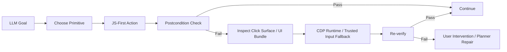

# Overview
This feature adds first-class browser debugging and execution tooling for LLM-driven workflow authoring. The goal is to let agents discover, inspect, verify, and recover using the same native Chrome + extension stack used for production workflows, while keeping runtime execution JS-first and reserving CDP for trusted input, Runtime evaluation, and hard-debug fallback paths. Constraints: preserve existing workflows, keep workflow steps schema-driven, avoid site-specific logic, and return structured evidence rather than ambiguous “success” booleans.

# Flow Diagrams


```text
Page / Content / Background split

MAIN WORLD PAGE BRIDGE
  - exposes helper shims on window
  - routes requests into content step execution

CONTENT SCRIPT
  - step handlers
  - DOM + shadow-aware inspection
  - UI bundle capture
  - semantic_action postcondition loop

BACKGROUND
  - tab/session selection
  - screenshot capture
  - JS-first eval via page bridge / chrome.scripting
  - CDP Runtime.evaluate only for explicit trusted fallback
  - health and bridge lifecycle
```

# Decision Record
| Decision | Chosen approach | Rejected alternative | Why |
|---|---|---|---|
| Arbitrary JS execution | Add explicit `eval_main_world` and `eval_isolated_world`; default to JS-first page bridge / `chrome.scripting`, with CDP opt-in for trusted fallback | Keep all JS eval on CDP | The debugger banner is too noisy and too detectable for ordinary eval |
| Debug evidence | Add `inspect_element`, `inspect_click_surface`, `capture_ui_bundle`, `verify_ui_change`, `read_field_value` | Depend on screenshots alone | Screenshots show symptoms, not interactive structure |
| Critical action reliability | Add `semantic_action` with mandatory postcondition verification by default | Let planners compose raw click/type/wait sequences ad hoc every time | Too much repeated logic; hard to debug when actions “succeed” without visible change |
| Runtime policy | JS-first for normal actions, CDP fallback for Runtime eval and trusted operations | All-CDP execution | Higher detection surface and more privilege than necessary |

# Architecture
## Modules
- `schema/actions-v1.json`
  Adds the new step types and preserves compatibility by keeping `execute_javascript` as a legacy alias with `world`.
- `extension/src/contentScript.ts`
  Implements inspection, UI verification, semantic actions, field readback, screenshot-backed bundle capture, and a versioned handshake/command surface for stale-tab recovery after extension reloads.
- `extension/src/background.ts`
  Adds JS-first `eval_with_scripting` using `chrome.scripting.executeScript`, keeps `eval_with_cdp` for explicit `Runtime.evaluate` fallback, keeps execution bound to the correct browser tab/session, normalizes content-script routing through versioned command names, and maintains a periodic native keepalive alarm so MV3 service-worker suspension does not silently strand the browser without a native-host connection.
- `extension/src/pageBridge.ts`
  Exposes ergonomic page-level helpers such as `__rznEvalMainWorld`, `__rznInspectElement`, and `__rznCaptureUiBundle`.
- `crates/rzn_browser_worker/src/main.rs`
  Extends worker health with bridge counts, client ids, browser session counts, ping latency, per-session bridge diagnostics, and last handshake/eviction evidence. JS-eval steps now stay on the background JS-first eval path unless the step explicitly requests CDP, socket-mode workers stay alive after stdin closes so shared-worker reuse actually survives the spawning CLI process exiting, and the browser bridge now re-reads its token on each handshake while actively reaping dead native-host sessions with keepalive probes.
- `crates/rzn_browser/src/native_runner.rs`
  Prints richer health summaries so failures are diagnosable before workflow execution, gives browser-side reconnects a wider attach window during live native-run validation, reuses an existing shared browser worker before spawning a new one, and keeps the shared worker alive on exit by default so sequential and parallel CLI sessions can reuse the same browser-side attachment.
- `crates/rzn_native_host/src/main.rs`
  Prefers the freshest published browser-bridge endpoint and treats explicit endpoint files as authoritative, avoiding stale dev/desktop app state hijacking a newer `native-run` worker.

## Data Contracts
```json
{
  "type": "inspect_click_surface",
  "selector": "#chatLabel"
}
```

```json
{
  "type": "semantic_action",
  "action": "click",
  "selector": "#openPanel",
  "postcondition": {
    "selector": "#panel",
    "condition": "visible"
  },
  "timeout_ms": 3000
}
```

```json
{
  "type": "capture_ui_bundle",
  "selector": "#panel",
  "include_dom_snapshot": true,
  "include_screenshot": true
}
```

# Implementation Notes
## New step surface
- `eval_main_world`
  Runs arbitrary JS through the page bridge when available, then `chrome.scripting.executeScript` in MAIN world. Add `use_cdp_eval: true` only when a trusted CDP gesture is required.
- `eval_isolated_world`
  Uses the JS-first scripting path and reports `execution_backend="chrome_scripting_main_world_for_isolated_eval"` for string eval because MV3 extension CSP blocks true arbitrary string eval in isolated world. Use explicit CDP only when that distinction matters more than the banner.
- `inspect_element`
  Returns element summary, actionable ancestor, ancestor chain, and shadow path.
- `inspect_click_surface`
  Returns target summary plus actionable ancestor, href/target, listener hints, and shadow path.
- `capture_ui_bundle`
  Returns URL/title/viewport/active element/visible overlays and optionally DOM snapshot + screenshot.
- `verify_ui_change`
  Waits for selector/url/text/value/focus/count predicates, including `all`/`any` groups.
- `read_field_value`
  Reads the current live value from form controls and content-like elements.
- `semantic_action`
  Wraps click/type/press/hover and requires a postcondition unless explicitly disabled.

## Native-run JS-eval bypass
Native-run previously depended on the generic content-script `execute_step` path for `execute_javascript`, which made live results vulnerable to stale content-script listeners after reloads. The runtime now treats JS eval as a first-class broker command:

```text
browser worker
  execute_javascript / eval_* step
    -> background runScriptingEval(...)
    -> structured scalar/object result

browser worker
  eval step with use_cdp_eval / backend:"cdp"
    -> background runCdpEval(...)
    -> structured scalar/object result
```

This keeps live JS return values off CDP by default while preserving the trusted fallback for the few places that need it.

## Shared worker lifetime
The CLI was already trying to keep spawned workers alive by default, but the worker process still exited on stdin EOF because its main loop treated the spawning CLI disappearing as a global shutdown signal.

```text
old behavior
  CLI exits
    -> worker stdin closes
    -> worker process exits
    -> later concurrent client hits Broken pipe

current behavior
  CLI exits
    -> worker stdin closes
    -> worker stays alive for socket clients
    -> worker exits only on explicit shutdown / process termination
```

This is what makes shared-worker reuse stable enough for concurrent `native-run --mode spawn` workflows to finish instead of one longer run losing its control socket when a shorter one ends.

## LLM orchestration guidance
Use this loop for arbitrary browser asks:
1. `inspect_click_surface` or `inspect_element` before inventing selectors.
2. `semantic_action` for visible state changes.
3. `read_field_value` immediately after typing.
4. `verify_ui_change` after every critical click or submit.
5. `capture_ui_bundle` when something fails or when a human review step is required.
6. Escalate to `eval_main_world` only when DOM actions or extraction primitives are insufficient.

## Example troubleshooting policy
```text
click failed visibly?
  -> inspect_click_surface
  -> capture_ui_bundle
  -> if action target exists but state did not change, retry with CDP-backed path
typed value missing?
  -> read_field_value
  -> verify_ui_change(value_contains / value_equals)
unknown widget state?
  -> inspect_element
  -> capture_ui_bundle
```

## Stale content-script recovery
Reloading the unpacked extension updates the background worker immediately, but already-open tabs can keep an older content-script runtime. The background now treats "content ready" as a versioned handshake, not a generic ping:

```text
ensureContentReady(tab)
  -> send rzn_handshake_v1
  -> if protocol_version matches, continue
  -> otherwise inject current contentScript.js
  -> retry handshake until the current protocol responds

background -> tab commands
  execute_step      => rzn_execute_step_v1
  get_dom_snapshot  => rzn_get_dom_snapshot_v1
```

This prevents older listeners on already-open tabs from falsely satisfying readiness checks after an extension reload.

## Session-scoped tab ownership
Parallel spawned sessions share one browser runtime, but they must not share tab state unless the workflow explicitly asks for it:

```text
built-in workflow
  -> create or reuse a dedicated workflow tab
  -> caller may continue with session_id + current_tab_id

explicit spawned workflow session
  -> create or reuse its dedicated workflow tab
  -> if a helper command arrives before that tab exists, fail closed
     instead of silently adopting the active tab
```

This matters most for broker-side helper commands such as `eval_with_cdp`, `get_page_source`, and CDP context reads. Without this guard, a session-scoped debug or extraction request can accidentally target the human’s visible tab and make the runtime look healthy while operating on the wrong page.

## Fresh bridge selection in the native host
Machines that have both desktop-app and CLI/debug endpoints can accumulate multiple `broker_endpoint_v1.json` files. The native host now sorts discovered app bases by freshest endpoint timestamp and, when a browser bridge exists, attaches to that freshest bridge instead of silently falling back to an older broker/runtime.

## Native keepalive recovery for MV3 suspension
The extension used to rely on explicit native-port disconnects to schedule reconnect alarms. In MV3, the service worker can be suspended without a clean `onDisconnect`, which leaves no native port and no queued reconnect work. The background runtime now installs a periodic keepalive alarm:

```text
service worker starts / installs
  -> ensureNativeKeepaliveAlarm()
  -> connectToNative()

every 30s keepalive alarm
  -> if nativePort missing
     -> reconnect native host
```

This gives native-run a way to recover from browser-side idling without a manual extension reload. The manifest must include the `alarms` permission; otherwise Chrome withholds `chrome.alarms` and this path silently degrades to best-effort in-memory timers.

## Bridge auth and stale-session recovery
The worker-side browser bridge used to snapshot the bridge token once at startup and trust native-host sessions to disappear cleanly. That is a bad bet for a long-lived automation runtime. The bridge now validates handshakes against the current token file on every incoming connection and keeps lightweight liveness probes running against each connected native host:

```text
incoming bridge socket accept
  -> read handshake frame
  -> read current browser_bridge_token_v1 from disk
  -> validate type/version/token
  -> record structured handshake failure if invalid

connected native host session
  -> every 30s send browser.session ping
  -> if pong returns, refresh last_ping_ok_at_ms
  -> if send/response times out, evict the session from the registry
  -> surface eviction + last handshake failure in rzn.worker.health
```

This closes the two ugly failure classes we were seeing in practice:
- token drift after long-lived workers or runtime repair no longer requires a worker restart.
- dead native-host sockets no longer sit in the registry forever pretending the bridge is healthy.

## Runtime artifact cleanup
The browser worker now cleans up its own runtime artifacts on shutdown instead of leaving stale endpoint pointers and dead socket files behind:

```text
worker exits
  -> clear browser_bridge/browser_worker endpoint entries if they still point at this pid/socket
  -> remove bridge/control socket files
  -> keep token files in place because they are durable auth material, not garbage
```

That split matters. Tokens are tiny and intentionally persistent; sockets and stale endpoint pointers are disposable and should disappear when the worker does.

# Tasks & Status
- [x] Add first-class JS eval step types to the canonical schema.
- [x] Add structured inspection and UI-bundle primitives in the extension runtime.
- [x] Add semantic actions with mandatory postconditions.
- [x] Add JS-first runtime evaluation in the background service worker, with CDP-backed eval as explicit fallback.
- [x] Add broker-facing eval routing so native-run JS eval bypasses stale content-script execute-step routing while staying non-CDP by default.
- [x] Add richer browser worker health details and CLI health summary.
- [x] Make the native host prefer the freshest browser-bridge endpoint over stale dev/broker state.
- [x] Add extension e2e coverage for old actions plus new debug primitives.
- [x] Document the LLM troubleshooting loop and hybrid execution policy.
- [x] Add browser-side native keepalive wakeups so MV3 suspension does not require manual extension reloads between live native-run sweeps.
- [x] Reuse a shared browser worker across parallel `native-run --mode spawn` invocations under one app base.
- [x] Enforce fail-closed tab ownership for explicit workflow sessions so helper commands cannot silently fall back to the active tab.
- [x] Keep socket-mode browser workers alive after stdin closes so concurrent CLI runs do not lose the shared control worker when one client exits.
- [x] Re-read the browser-bridge token on each handshake instead of freezing auth state at worker startup.
- [x] Add browser-bridge keepalive eviction so dead native-host sessions do not accumulate as zombie sockets.
- [x] Surface bridge handshake and eviction diagnostics in `rzn.worker.health`.
- [x] Clean up worker-owned socket files and endpoint entries on shutdown instead of leaving stale runtime artifacts behind.

# What Works (Do Not Change)
- Existing workflow steps such as `click_element`, `fill_input_field`, `take_screenshot`, `wait_for_element`, and `request_user_intervention` continue to work.
- Built-in workflows stay dedicated-tab by default; active-tab binding is only a manual debugging escape hatch.
- `execute_javascript` still exists for compatibility; it now routes through the new eval surface instead of a hard-coded pattern parser.
- Health checks still degrade safely when the native host or browser bridge is missing.
- Background-to-tab messaging now uses versioned command names so freshly injected scripts can win cleanly over stale listeners on older tabs.
- The browser worker control socket is a shared runtime surface. Multiple CLI clients may attach concurrently, and CLI shutdown should not tear the shared worker down unless `RZN_KILL_BROWSER_WORKER_ON_EXIT=1` is explicitly set.
- Explicit workflow sessions must keep their own dedicated workflow tabs. Continue by passing the session's `current_tab_id`; do not silently adopt the active tab.
- Browser-bridge auth is sourced from the current token file, not a startup snapshot. Rotating or repairing the token file must not require a worker restart.
- Dead native-host bridge sessions should be evicted automatically; a live socket entry in health must mean something.
- Worker-owned socket files and endpoint entries are ephemeral. They should be removed on shutdown; token files are the only durable bridge artifacts that should remain.

# Tried & Didn’t Work
- Content-script `Function` / `AsyncFunction` execution:
  Failed because extension CSP blocks `unsafe-eval`.
- Blob/data-module import execution from the content/page world:
  Failed in the extension test runtime with dynamic import fetch restrictions.
- Treating screenshots as the only debugger:
  Useful for symptom confirmation, but insufficient for target/actionability diagnosis.
- Generic ping-based content readiness:
  Failed after extension reloads because old content scripts on already-open tabs could still answer pings and then mishandle newer step types.
- Reusing whichever app-base endpoint the native host discovered first:
  Failed on machines with both `rzn_debug` and `rzn-browser`, because older endpoint files could hijack a fresh native-run session.
- Treating every `native-run --mode spawn` as a private worker:
  Failed under concurrency because parallel CLI runs raced on one shared endpoint file/socket and one client could kill the shared worker out from under the others.
- Letting session-scoped helper commands fall back to the active tab:
  Failed under parallel execution because tab/session routing could look correct at the worker level while a late helper request still targeted the wrong visible page.
- Letting the spawned worker exit on stdin EOF:
  Failed even after the CLI stopped explicitly killing the worker, because the worker still treated the parent CLI's exit as an instruction to terminate its socket server.
