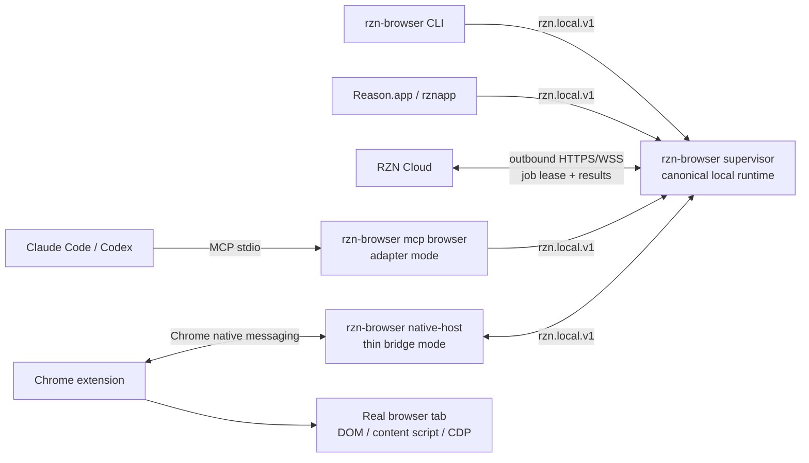
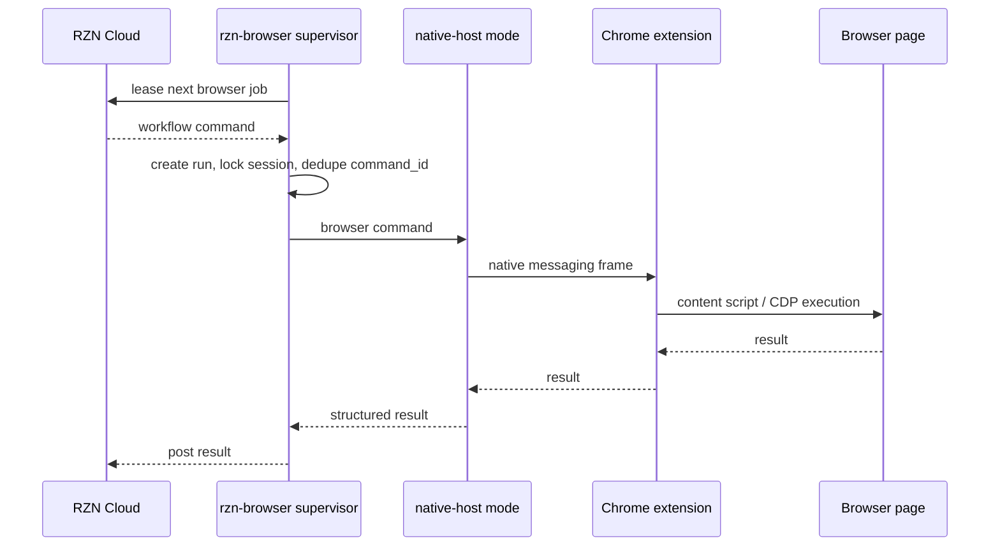
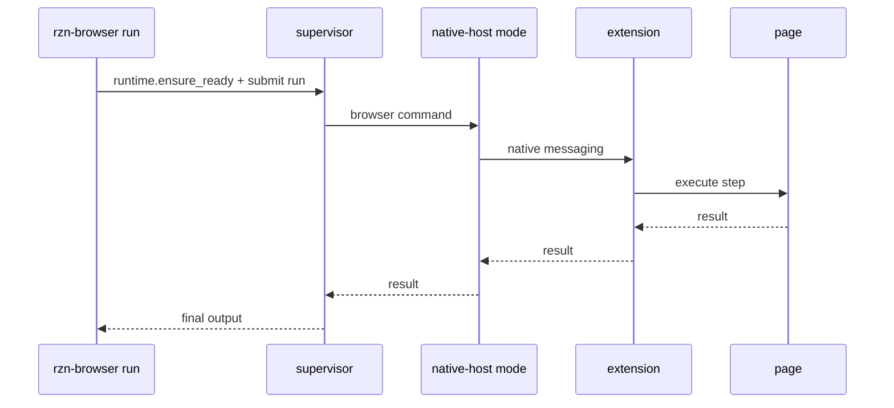
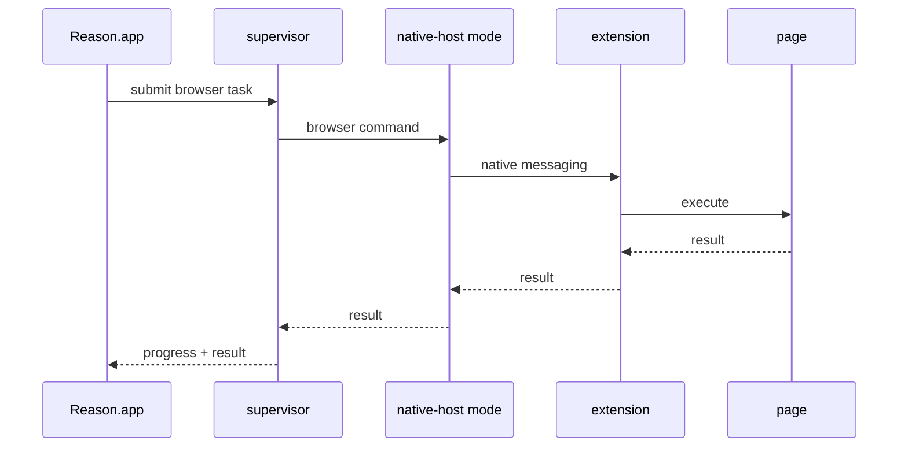
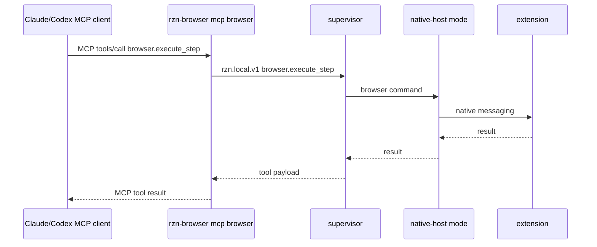

# Local Browser Runtime Supervisor

## Overview
- Goal: make browser automation launch-grade by giving `rzn-browser` one durable local runtime contract that can serve CLI jobs, MCP clients, the Reason Tauri app, and cloud-dispatched jobs without requiring the app to be open or depending on cached worker pid files as authority. The Chrome extension remains mandatory because it is the only component that can execute inside the real browser profile. The Chrome native host remains mandatory because it is the browser-supported local bridge for the extension. Everything else should converge on one shipped native binary with multiple process modes.
- Constraints: Chrome owns native-host process lifetime; MV3 service workers are suspendable; MCP stdio clients own the MCP server subprocess lifetime; cloud control must use outbound local-device connections; Reason app is currently the only product client but has not launched, so we can migrate it aggressively.

## Flow Diagrams

### Target component topology

### Cloud-dispatched job

### CLI job

### Reason app job

### MCP job

## Decision Record

| # | Decision | Rejected alternative | Rationale |
|---|---|---|---|
| 1 | Ship one browser-native binary, `rzn-browser`, with multiple modes. | Ship separate `rzn-browser-worker`, `rzn-native-host`, `rzn-browser` CLI binaries as independent durable actors. | One artifact reduces install/update drift. Process roles still stay clean. |
| 2 | Add a durable `rzn-browser supervisor` process role as the local source of truth. | Let Reason app, native host, or browser worker own runtime state. | Reason app is optional, native host is Chrome-owned, and the worker endpoint model is where stale pid/socket failures came from. |
| 3 | Keep the Chrome native host as a thin extension bridge. | Make native host the public MCP server or cloud actor owner. | Chrome owns native-host stdin/stdout and lifecycle. MCP stdio and cloud ownership need a process not controlled by Chrome. |
| 4 | Fold `rzn-browser-worker` MCP tool logic into `rzn-browser mcp browser`. | Keep `rzn-browser-worker` as a separate long-lived MCP/browser bridge daemon. | The tool surface is good; the extra daemon and endpoint authority are the fragile parts. |
| 5 | Use `rzn.local.v1` as the internal local IPC contract. | Use MCP as the internal bus everywhere. | MCP is a client-facing tool protocol. The internal runtime also needs lifecycle, extension registration, cloud leases, dedupe, health, policy state, and repair commands. |
| 6 | Move cloud actor ownership into supervisor. | Keep cloud lease/polling in the native host. | Cloud jobs must not depend on Chrome deciding to keep a native-host process alive. |
| 7 | Migrate Reason app to supervisor calls for browser automation. | Continue app plugin worker spawning for browser jobs. | The app should be a client of the same runtime as CLI, MCP, and cloud, not a parallel owner. |

## Architecture

### Shipped artifacts

| Artifact | Repo | Launch owner | Required for browser automation | Target responsibility |
|---|---|---|---|---|
| `rzn-browser` | `rzn-browser` | user, installer, Chrome, MCP client, app | yes | Single native binary containing CLI, supervisor, native-host mode, MCP adapter, and heal. |
| Chrome extension | `rzn-browser/extension` | Chrome | yes | Browser execution, tab/session routing, content scripts, CDP escalation. |
| `Reason.app` / `rznapp` | `rznapp` | user | no | Product UI client and orchestration surface. |
| `rzn-browser-worker` | `rzn-browser` | legacy CLI/app paths | no | Retire as a shipped durable binary; migrate its MCP browser tool surface into `rzn-browser`. |
| `rzn-mcp-shim` | `rznapp` | MCP client | no for browser automation | App-side MCP bridge for Reason-owned tools, not the browser runtime owner. |

### `rzn-browser` process modes

| Mode | Example invocation | Lifetime | Notes |
|---|---|---|---|
| Supervisor | `rzn-browser supervisor` | long-lived | Owns runtime state, sessions, extension availability, cloud actor, local IPC, repair state. |
| Native host | `rzn-browser native-host` | Chrome-owned | Reads/writes Chrome native messaging and forwards extension frames to supervisor. |
| CLI client | `rzn-browser run ...` | short-lived | Calls supervisor; auto-starts or heals supervisor when safe. |
| MCP adapter | `rzn-browser mcp browser` | MCP-client-owned | Speaks MCP stdio externally and `rzn.local.v1` internally. |
| Heal | `rzn-browser heal` | short-lived | Repairs manifests, stale legacy endpoints, supervisor state, extension/native-host diagnostics. |

### Internal local contract

`rzn.local.v1` is a local framed JSON-RPC-style contract over a user-scoped socket or platform named pipe. Endpoint files may remain as compatibility hints during migration, but a cached pid/socket is never authority without a live authenticated handshake.

Minimum supervisor methods:

| Method | Purpose |
|---|---|
| `runtime.hello` | Version, pid, profile, protocol version, capabilities. |
| `runtime.status` | Supervisor, extension, native-host bridge, cloud actor, sessions, legacy endpoint state. |
| `runtime.ensure_ready` | Start/attach/heal everything that can be repaired without replaying side effects. |
| `runtime.heal` | Explicit repair command with structured actions and diagnostics. |
| `browser.session_open` | Create or attach a browser workflow session. |
| `browser.execute_step` | Execute a typed browser action through extension/native host. |
| `browser.snapshot` | Capture compact page state through extension. |
| `browser.poll_events` | Stream/poll session events. |
| `browser.session_close` | Close or release session resources. |
| `cloud.status` | Report actor pairing, lease loop, and last dispatch state. |

### Producer migration contract

| Producer | Target ingress | Must own | Must not own | First proof |
|---|---|---|---|---|
| CLI | `rzn-browser run ...` calls `runtime.ensure_ready`, then `browser.*` methods. | Job submission, output formatting, local heal request. | Durable runtime state, extension reachability, cached endpoint authority. | CLI run survives stale `broker_endpoint_v1.json` without manual cleanup. |
| MCP | `rzn-browser mcp browser` speaks MCP stdio externally and `rzn.local.v1` internally. | MCP tool schema and client-facing result shape. | Browser worker daemon lifetime or native-host lifecycle. | MCP adapter restart does not kill supervisor session state. |
| Cloud | Supervisor cloud actor module leases jobs, spools, dedupes, dispatches, and posts results. | OAuth refresh token, outbound polling, command spool, terminal result cache. | Native-host-owned lease loop or refresh token storage. | Duplicate cloud `command_id` is suppressed before extension dispatch. |
| Reason app | Tauri command or app-side adapter calls the supervisor contract directly, or wraps `rzn-browser mcp browser` as a client. | Product UI, app-owned non-browser MCP/plugins, optional approval UI. | Browser plugin worker discovery as the default runtime owner. | `window.__AGENT__.browser` smoke can run with no browser plugin worker selected. |

### Current Reason app supervisor client paths

These anchors were inspected from `/Users/sarav/Downloads/side/rzn/rznapp` for `LRT-T-0007`; the default browser path now uses the supervisor-backed client, while explicit plugin-worker selection remains a dev compatibility escape hatch.

| Path | Current behavior | Target behavior |
|---|---|---|
| `src/agent/browserSupervisorClient.ts` | Tauri invoke wrapper for `runtime.ensure_ready`, generic supervisor calls, and `tools/call`. | Keep as the browser helper used by app dev surfaces. |
| `src/agent/bridge.ts` | `window.__AGENT__.browser` defaults to the supervisor client; passing `serverName` explicitly still routes through the old plugin-worker MCP helper. | Preserve explicit override only for legacy/dev debugging. |
| `src-tauri/src/browser_supervisor.rs` | Executes `rzn-browser supervisor ensure-ready/call` with strict legacy-worker fallback disabled by default. | Keep the app as a supervisor client, not a runtime owner. |
| `src-tauri/src/mcp/minimal_server.rs` | `rzn.browser.session` maps legacy browser commands to `rzn.local.v1` methods and calls supervisor directly. | Keep the public MCP tool stable while removing app native-host registry ownership from browser tasks. |
| `src-tauri/src/broker/native_host.rs` | App-local native-host registry remains compatibility-only. | Do not use this registry as browser automation readiness authority. |

### Restart matrix scaffold

The machine-readable restart matrix lives at `restart_matrix.v1.json` and is validated by `crates/rzn_contracts/tests/supervisor_runtime_matrix.rs`. It is deliberately split into two lanes:

| Lane | Purpose | Expected automation |
|---|---|---|
| CI-safe contract lane | Validate producer/churn coverage, command-id/session invariants, and fake-dispatcher behavior without a real Chrome profile. | `cargo test -p rzn_contracts --test supervisor_runtime_matrix` |
| Local full-runtime lane | Exercise the installed extension/native-host/supervisor path in the user's existing Chrome session. | Manual or scripted macOS run after supervisor IPC lands; no Playwright-managed browser for the product path. |

Minimum full-runtime scenarios:

| Scenario | Expected invariant |
|---|---|
| Supervisor restart during CLI run | CLI reattaches through handshake and either resumes or fails explicitly before replaying side effects. |
| MCP adapter subprocess restart | Supervisor session and extension bridge state outlive the MCP stdio process. |
| Cloud redelivery after supervisor crash | Same `command_id` is not dispatched twice to the extension; terminal result is replayed or the lease fails clearly. |
| Reason app closed and reopened | Browser automation remains available to CLI/MCP/cloud; app is only a producer when open. |
| Extension service-worker restart | Session store reloads and supervisor sees a degraded/recovered bridge state. |
| Chrome/native-host restart | Supervisor marks extension/bridge degraded, then reconnects without pid/socket cleanup. |
| Stale legacy endpoint file | Endpoint file is ignored as authority and pruned by heal/status flow. |

### Source anchors

- Current MCP browser tool surface: `crates/rzn_browser_worker/src/main.rs`.
- Current CLI native runner and heal surface: `crates/rzn_browser/src/native_runner.rs`, `crates/rzn_browser/src/main.rs`.
- Current native host bridge: `crates/rzn_native_host/src/main.rs`.
- Current supervisor cloud ownership: `crates/rzn_browser/src/supervisor_cloud.rs`; native-host cloud controls are compatibility forwarders.
- Current endpoint cache utilities: `crates/rzn_broker_endpoint/src/lib.rs`.
- Extension browser executor: `extension/src/background.ts`, `extension/src/contentScript.ts`.
- Reason app MCP/plugin manager: `/Users/sarav/Downloads/side/rzn/rznapp/src-tauri/src/mcp/`, `/Users/sarav/Downloads/side/rzn/rznapp/src/agent/bridge.ts`.
- Team review handoff: `docs/features/local_supervisor_runtime/TEAM_REVIEW_NOTES.md`.

## Implementation Notes

- Supervisor startup should be idempotent. CLI, MCP adapter, Reason app, and installer can all call `runtime.ensure_ready`; only one supervisor wins the lock.
- Native host must register with supervisor on startup and reconnect with backoff. If supervisor is absent, native host may attempt local supervisor startup, but it should not become state authority.
- Extension absence is a degraded runtime state, not a crash. `runtime.status` must say "supervisor alive, extension unavailable" and identify the install/reload action needed.
- `rzn-browser mcp browser` should reuse the existing browser worker tool list and result shape where possible so existing MCP clients see stable tool names: `browser.session_open`, `browser.snapshot`, `browser.execute_step`, `browser.poll_events`, plus health.
- Cloud dispatch should dedupe by cloud `command_id` before sending anything to the extension. The extension should never see duplicate live commands for one cloud command.
- `rzn-browser heal` should operate in layers: prune legacy endpoints, verify supervisor IPC, start supervisor, verify native-host manifest, verify extension bridge, then optionally warm a browser session.
- Legacy `broker_endpoint_v1.json` should be pruned and read only for migration compatibility. New code should prefer supervisor discovery through a stable socket path plus handshake.

### Native-host bridge slice

- `crates/rzn_native_host/src/main.rs` now treats upstream connections as runtime bridge endpoints instead of a single worker-specific socket. It has two endpoint kinds: `supervisor_local_v1` for the target `rzn.local.v1` runtime and `legacy_browser_bridge_v1` for the current worker-owned compatibility path.
- The supervisor endpoint is discovered first from the installed app base layout (`run/rzn-supervisor.sock` plus `secure/rzn-supervisor-token-v1`) and can also be overridden by `RZN_LOCAL_RUNTIME_SOCKET_PATH` / `RZN_LOCAL_RUNTIME_TOKEN_PATH` or the legacy aliases `RZN_SUPERVISOR_SOCKET_PATH` / `RZN_SUPERVISOR_TOKEN_PATH`. Native-host attempts a framed JSON `runtime.hello` handshake and advertises itself as `native_host_bridge`.
- The target supervisor-to-native-host call surface is intentionally thin: `native_host.extension_call` carries `{ cmd, payload, data?, req_id, timeout_ms }` to the Chrome extension. Native-host does not implement planner, MCP, session, or cloud policy logic in this path.
- Chrome native messaging framing and the existing `browser.session` bridge remain unchanged for compatibility. The native-host status command `runtime_bridge_get_status` reports the supervisor bridge as preferred when the supervisor socket/token exist while the legacy bridge stays active.
- Native-host no longer starts the cloud actor loop. `cloud_get_status`, `cloud_set_config`, and `cloud_clear_config` are compatibility controls that forward to supervisor `cloud.status`, `cloud.set_config`, and `cloud.clear_config` when a supervisor endpoint is available.

### Implemented migration slice

- `rzn-browser supervisor serve/status/ensure-ready/shutdown/call` owns a user-scoped `rzn.local.v1` socket and authenticated token under the app base.
- Auto-spawned supervisors are detached into their own Unix process group. Short-lived CLI/MCP/agent wrappers must be able to exit without process-group cleanup killing the supervisor they just started.
- Installed native binaries must be replaced atomically with temp-file-plus-rename. Copying over a live macOS executable path can leave future launches stuck in dyld before `main`; the installer scripts use `install_file_atomic` for this reason.
- `rzn-browser run` now defaults to supervisor mode. Supervisor-mode runs call `runtime.ensure_ready` before browser work and require a live native-host bridge by default.
- Legacy browser worker fallback is no longer silent on the supervisor default path. It is only available through `--allow-legacy-worker-fallback` or `RZN_SUPERVISOR_ALLOW_LEGACY_WORKER_FALLBACK=1` for compatibility debugging.
- `rzn-browser mcp browser` exposes the existing MCP browser tool names and routes through the supervisor. `rzn.worker.shutdown` now shuts down the legacy worker compatibility client, not the supervisor.
- `rzn-browser supervisor` starts the supervisor cloud actor, owns cloud config/status, connects to the dev-harness cloud WebSocket actor endpoint when configured, and dispatches cloud browser commands over the native-host bridge.
- Cloud command redelivery is deduped in the supervisor before extension dispatch via a terminal result cache keyed by `command_id`; `lease_id` remains an attempt id.
- `runtime.ensure_ready` reports separate readiness fields for supervisor, native-host bridge, and legacy worker fallback instead of treating a stale worker endpoint as proof of browser readiness.
- `runtime.ensure_ready` now actively pings the extension through the native-host bridge. A registered bridge is not considered ready unless the extension answers the probe.
- The extension readiness ping must advertise `capabilities.content_keepalive_port=true`. A stale loaded extension bundle can still answer `pong`; it is not considered launch-ready unless it exposes the current keepalive bridge capability.
- If the extension bridge request times out, the supervisor evicts that native-host bridge immediately. A timed-out bridge must not remain registered as "connected" because that creates a zombie health state.
- If a local send fails and the native-host bridge reconnects before retry, timeout cleanup follows the reconnected bridge id. The supervisor must not leave the replacement bridge registered after that replacement proves unresponsive.
- Before sending a browser command, the supervisor waits up to 20 seconds for a missing native-host bridge to reconnect. It only retries the local send when the request never entered the native-host writer queue; it does not replay timed-out browser steps that may already have caused side effects.
- Extension-side browser calls are bounded in two places: `execute_javascript` treats observed tab navigation as a successful fire-and-return result instead of waiting for a lost eval reply, and content-script messages are wrapped in real timeouts.
- `dismiss_popups` is capped by count and wall-clock time. It is a best-effort cleanup step, not a command allowed to scan/click indefinitely.
- Content scripts send a lightweight `RZN_WAKE_NATIVE` message on load/focus/visibility to wake the MV3 background worker and reconnect the native host after Chrome or native-host churn.
- Top-level content scripts also hold a lightweight `rzn_content_keepalive` runtime port and send a heartbeat every 15 seconds. This gives ordinary open tabs an active MV3 wake path; the 30-second alarm remains a fallback, not the only recovery mechanism. The port is suspended on `pagehide` and reopened on `pageshow` so Chrome back/forward-cache transitions do not leave unchecked port-disconnect errors.
- The extension manifest includes the `alarms` permission. Without it, the 30s MV3 keepalive code exists but Chrome does not grant `chrome.alarms`, so the service worker cannot self-wake reliably.
- `rzn-browser heal` now starts/contacts the supervisor and runs `runtime.heal` after legacy endpoint cleanup. `runtime.heal` performs a live readiness probe, waits through one MV3 keepalive recovery window before declaring the native-host bridge absent, and runs one short post-probe reconnect pass when a timed-out probe forced bridge eviction. Stale extension capability failures still return `ready=false` because loaded Chrome extension code cannot be upgraded without a reload.

## Tasks & Status

- [x] `LRT-T-0001` - Document local browser runtime supervisor architecture.
- [x] `LRT-T-0002` - Implement durable `rzn-browser supervisor` runtime.
- [x] `LRT-T-0003` - Convert native host into thin extension-to-supervisor bridge. Native-host can discover, handshake, and forward supervisor extension calls while keeping legacy bridge fallback.
- [x] `LRT-T-0004` - Fold browser worker MCP surface into `rzn-browser mcp browser`.
- [x] `LRT-T-0005` - Move cloud browser actor ownership into supervisor. Supervisor owns status/config, dev-harness WebSocket actor lifecycle, bridge dispatch, and duplicate `command_id` suppression; native host no longer starts the actor loop.
- [x] `LRT-T-0006` - Migrate `rzn-browser` CLI execution onto supervisor client.
- [x] `LRT-T-0007` - Migrate Reason app browser automation away from plugin worker dependency. App browser helpers and `rzn.browser.session` now default to supervisor calls; plugin-worker routing is explicit compatibility only.
- [x] `LRT-T-0008` - Add supervisor heal and restart recovery contract.
- [x] `LRT-T-0009` - Add restart matrix tests for CLI, MCP, cloud, app, and extension churn. CI-safe contract coverage exists; live Chrome/runtime restart tests remain local gates.

## What Works (Do Not Change)

- The Chrome extension remains the browser executor. Do not replace the main product path with Playwright/WebDriver.
- Chrome native messaging remains the extension's local bridge. Do not try to make the browser speak directly to the cloud or arbitrary local clients.
- The typed browser action model remains the stable execution language. Preserve `StepKind`, action result metadata, snapshots, and CDP escalation semantics.
- CLI, MCP, Reason app, and cloud must all be producers. None of them should be the only runtime owner.
- Native attach/spawn healing already added around stale endpoint pruning is useful compatibility work; preserve it while moving authority to supervisor handshakes.

## Tried & Didn't Work

- Treating `broker_endpoint_v1.json` as authority: dead pids and orphan sockets create false availability. It can be a hint only.
- Making the Reason app a hidden runtime prerequisite: this breaks CLI, MCP, and cloud jobs and makes browser automation feel random to end users.
- Letting Chrome native host own durable state: Chrome controls the process lifecycle, so restarts and MV3 service-worker churn can strand state.
- Assuming the MV3 service worker's "Inactive" label is an error: it is normal Chrome behavior. The actionable signal is whether `runtime.ensure_ready` can ping the extension through native messaging.
- Keeping a bridge registered after a request timeout: this makes the supervisor look connected while every workflow is routed into a dead channel. Timeout must evict the bridge.
- Treating any extension `pong` as readiness: stale loaded bundles can answer basic pings while missing bridge recovery code. Readiness must check explicit extension capabilities, not just transport liveness.
- Replaying browser steps after a bridge timeout: the extension may have already clicked, typed, or submitted before the response was lost. Recovery can wait before sending, but timed-out side-effectful commands must fail explicitly.
- Relying on the CLI to force Chrome to launch a native host: native messaging is browser-owned. The CLI can start and heal the supervisor, but the extension must be awake to call `connectNative`; recovery should come from extension events, page-originated keepalive ports, and alarms.
- Keeping `rzn-browser-worker` as a separate durable bridge forever: it solved early MCP/CLI integration, but public launch needs fewer independently versioned runtime owners.
- Using MCP as the internal bus: useful at the edge, too narrow for local lifecycle and recovery control.
