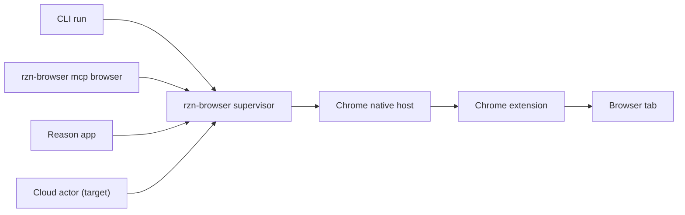

# Local Supervisor Runtime - Team Review Notes

## Current Take

The right architecture is a durable `rzn-browser supervisor` as the local authority, with CLI, MCP, Reason app, and cloud acting as producers. Chrome extension and native host stay mandatory browser transport pieces. The old problem was not "a file exists"; it was treating a cached pid/socket file as authority. The new rule is stricter: browser readiness requires an authenticated live supervisor/native-host handshake.



## What Changed In This Slice

| Area | Status | Notes |
|---|---|---|
| Supervisor IPC | Implemented | `rzn-browser supervisor serve/status/ensure-ready/shutdown/call` owns `rzn.local.v1` socket/token under app base. |
| CLI default | Implemented | `rzn-browser run` defaults to `--via supervisor`. |
| Strict browser readiness | Implemented | Default supervisor browser calls require a connected native-host bridge; no silent legacy worker fallback. |
| Legacy fallback | Explicit only | Use `--allow-legacy-worker-fallback` for compatibility debugging. |
| MCP browser adapter | Implemented | `rzn-browser mcp browser` preserves existing browser tool names and routes through supervisor. |
| Native-host bridge | Implemented slice | Native host discovers supervisor from app base or env, handshakes, and forwards `native_host.extension_call`. |
| Restart matrix | Implemented scaffold | CI-safe fixture/test coverage exists; local full-runtime Chrome tests still needed. |
| Heal command | Implemented slice | `rzn-browser heal` performs legacy endpoint cleanup and supervisor startup/heal in one command. |

## Still Not Launch-Complete

| Gate | Owner | Required Before Public Launch |
|---|---|---|
| Cloud actor ownership | Browser/runtime | Move cloud lease loop, command spool, dedupe, and result cache from Chrome-owned native host into supervisor. |
| Reason app migration | App/runtime | Stop auto-starting browser plugin workers as the default browser path; call supervisor-backed browser tools instead. |
| Packaging binary contract | Release/runtime | Decide whether launch ships separate `rzn-native-host` or invests in a true single-binary/native-host entrypoint. Docs must match the installer. |
| Full runtime restart tests | QA/runtime | Exercise existing Chrome profile plus installed extension/native host through supervisor, MCP, CLI, app restart, extension reload, and Chrome restart. |
| Full heal diagnostics | CLI/runtime | Add native-host manifest and extension reload/install checks to the current supervisor-aware `rzn-browser heal` flow. |

## Why This Is More Robust

| Old behavior | New behavior |
|---|---|
| Cached endpoint-file pid/socket could decide availability. | Supervisor socket/token are only hints until a live authenticated handshake succeeds. |
| CLI could require Reason app or a worker process to be alive. | CLI starts/uses supervisor directly; Reason app is only another producer. |
| MCP browser tools depended on a separate browser worker lifetime. | MCP stdio adapter is thin and supervisor-backed. |
| Native host and worker could both appear to own browser runtime state. | Native host is a bridge; supervisor is the intended authority. |
| Legacy worker fallback could hide the real native-host bridge outage. | Worker fallback is removed; the supervisor reports bridge readiness directly. |

## Test Commands

```bash
cargo check --workspace
cargo test -p rzn-browser
cargo test -p rzn-native-host
cargo test -p rzn_contracts
```

Local lifecycle smoke:

```bash
APP_BASE="$(mktemp -d)"
target/debug/rzn-browser supervisor serve --app-base "$APP_BASE" --json
target/debug/rzn-browser supervisor status --app-base "$APP_BASE" --json
target/debug/rzn-browser supervisor shutdown --app-base "$APP_BASE" --json
```

Strict readiness smoke with the real browser path:

```bash
target/debug/rzn-browser supervisor ensure-ready --json
target/debug/rzn-browser run google search --param search_query=rust
```

If Chrome or the extension is not connected, the second command should fail clearly with `native_host_bridge.connected=false`; that is intentional. Do not "fix" that by re-enabling silent worker fallback.
