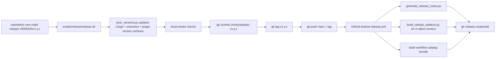

# Public Release Pipeline

## Overview
- Goal: Ship a repeatable public release flow for `rzn-browser` that starts from `make release VERSION=x.y.z`, creates a tagged release, pushes it to GitHub, builds native artifacts on Linux x64, Windows x64, macOS Intel, and macOS Apple Silicon, and publishes a GitHub Release with installer-ready notes generated from the commit range since the previous tag.
- Constraints: Keep latest-download asset names stable because `install.sh`, `install.ps1`, and `rzn-browser workflow pull` depend on them; avoid local feature branches because this repo releases from `main`; support Windows native messaging correctly via the registry instead of pretending the Unix manifest path works there.

## Flow Diagrams
- End-to-end flow



- Internal flow(s)

```text
release.sh
  -> validate clean main branch
  -> sync version surfaces
  -> run smoke checks
  -> assert no unexpected dirty files
  -> commit + tag + push

release.yml
  -> resolve tag/version
  -> generate release notes (LLM if configured, fallback otherwise)
  -> matrix build native bundles
  -> build workflow catalog tarball
  -> publish GitHub Release + upload assets
```

## Decision Record
- Use a tag-driven GitHub release workflow instead of local artifact publishing. That keeps the platform matrix on native GitHub runners where Linux/Windows/macOS builds actually make sense.
- Keep release asset filenames stable and put the version inside the tag, release title, and bundle metadata. That preserves the existing latest-download bootstrap flows without ugly redirect hacks.
- Generate release notes from commits and changed files instead of GitHub auto-notes alone. The stock GitHub notes are serviceable, but they’re noisy and love credit-roll nonsense. This flow explicitly bans contributor shout-outs and keeps the output installer-focused.
- Add a Windows PowerShell installer and Chrome registry registration. Anything else is fake Windows support.

## Architecture
- Modules

| Path | Responsibility |
| --- | --- |
| `scripts/release/release.sh` | Local operator command: validate, sync versions, check, commit, tag, push |
| `scripts/release/sync_versions.py` | Update all release-version surfaces in one shot |
| `scripts/release/build_release_artifacts.py` | Cross-platform runtime/workflow bundling and checksum generation |
| `scripts/release/generate_release_notes.py` | Commit-range summarization with OpenAI fallback logic |
| `scripts/release/install-runtime.sh` | Packaged Unix installer |
| `scripts/release/install-runtime.ps1` | Packaged Windows installer + registry wiring |
| `.github/workflows/release.yml` | Tag-driven GitHub Release orchestration |
| `install.ps1` | Windows bootstrap installer from latest GitHub release |

- Data contracts
  - Tag format: `v<semver>` where semver is `major.minor.patch`
  - Runtime assets: `rzn-browser-<platform>.tar.gz` or `rzn-browser-<platform>.zip`
  - Workflow catalog asset: `rzn-browser-workflows.tar.gz`
  - Sidecar metadata: `*.manifest.json` and `*.sha256`

## Implementation Notes
- Entry points
  - Maintainer entry: `make release VERSION=x.y.z`
  - CI entry: `.github/workflows/release.yml` on `push.tags = v*.*.*`
- Key calls and event flow
  - `release.sh` only stages the version files it changed. If anything else gets dirty during checks, it aborts before commit.
  - `generate_release_notes.py` reads the previous tag with `git describe --tags --abbrev=0 <tag>^`, collects commits/files, then calls the Responses API if `OPENAI_API_KEY` exists. If that fails, it writes a deterministic markdown fallback instead of failing the release.
  - `build_release_artifacts.py` packages binaries, extension, workflows, examples, installer, checksums, and a bundle manifest. Windows gets a `.zip`; Unix gets `.tar.gz`.
  - `install-runtime.ps1` writes the Chrome native messaging registration to `HKCU\Software\Google\Chrome\NativeMessagingHosts\<host>` because that’s how Chrome on Windows actually works.
- Error handling & retries
  - Release notes generation is soft-fail.
  - Duplicate tags fail fast locally before any commit/tag push.
  - Unexpected worktree mutations fail the local release before commit.

## Tasks & Status
- [x] Add local `make release VERSION=x.y.z` orchestration
- [x] Add cross-platform artifact bundling with checksums and bundle metadata
- [x] Add Windows installer and bootstrap path
- [x] Add tag-driven GitHub Release workflow
- [x] Add LLM-assisted release note generation with deterministic fallback
- [x] Document operator flow and public install paths

## What Works (Do Not Change)
- Latest-download asset names stay stable:
  - `rzn-browser-linux-x64.tar.gz`
  - `rzn-browser-macos-arm64.tar.gz`
  - `rzn-browser-macos-x64.tar.gz`
  - `rzn-browser-windows-x64.zip`
  - `rzn-browser-workflows.tar.gz`
- `rzn-browser workflow pull` must keep pulling `rzn-browser-workflows.tar.gz`.
- Public installers must remain bootstrap-friendly:
  - Unix: `install.sh`
  - Windows: `install.ps1`

## Tried & Didn’t Work
- Using only the old host-local `release-artifacts` shell script: good for one machine, useless for a public multi-platform release.
- Treating Windows like Linux and dropping a manifest under `NativeMessagingHosts/`: Chrome on Windows wants a registry entry. Anything else is broken theater.
