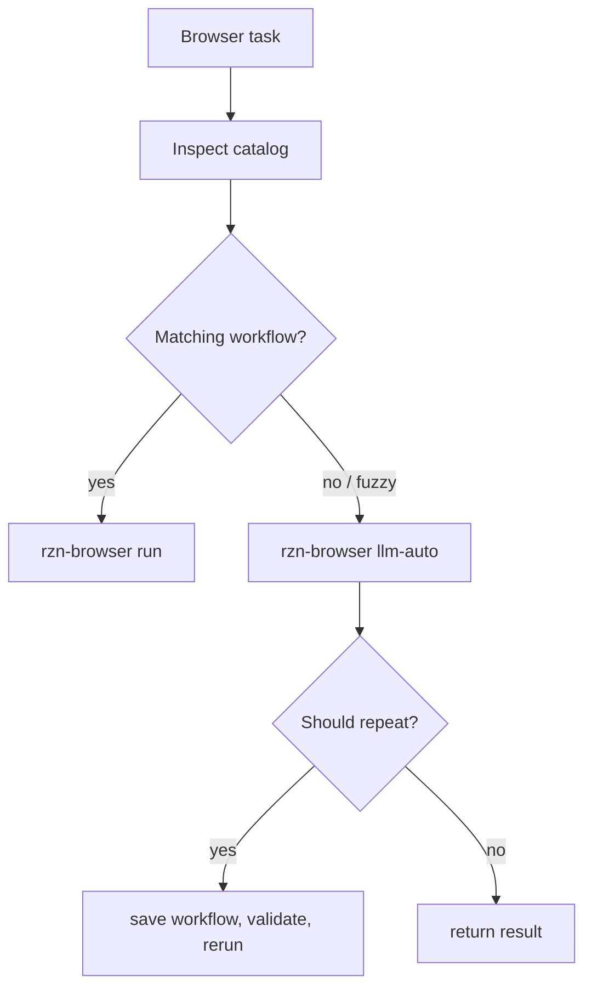

# RZN Browser Agent Skill

## Overview
- Goal: package the repo's operational knowledge as an Agent Skill that lets coding agents use RZN Browser directly from the CLI, choosing between deterministic workflow packs and `llm-auto` without writing Python helpers or launching separate browser stacks. Constraints: the skill must remain portable, concise, compatible with the Agent Skills folder format, and aligned with the repo's existing Chrome extension/native-host model.

## Flow Diagrams
- End-to-end flow
```
 rzn-browser skill install/update/remove
  -> managed canonical skill copy
  -> symlinks for Codex / Claude Code / Gemini / Agent Skills

 Agent task
  -> symlinked skills/rzn-browser/SKILL.md
  -> direct rzn-browser CLI
  -> native host / extension
  -> user's existing Chrome session
  -> workflow output or llm-auto result
```

- Decision flow


## Decision Record
- Chosen approach: a script-free Agent Skill under `skills/rzn-browser` with progressive references for CLI commands, runtime troubleshooting, and workflow authoring.
- Chosen install approach: `rzn-browser skill` manages one canonical copy, then symlinks Codex, Claude Code, Gemini CLI, and generic Agent Skills paths to it. Symlinks are the right default because updates do not leave stale client-specific copies.
- Why: the user explicitly asked for direct CLI and no Python scripts. Wrapping the CLI would add another failure surface; the CLI already exposes the right interface.
- Alternatives considered: expanding `rzn-workflow-builder`; rejected because that skill is authoring-focused, while this skill is broader and should trigger for everyday automation, extraction, and `llm-auto` use.
- Alternative considered: one huge `SKILL.md`; rejected because agents should load detailed command notes only when needed.

## Architecture
- Modules: `skills/rzn-browser/SKILL.md` is the activation surface and core operating policy.
- Modules: `skills/rzn-browser/references/cli-cheatsheet.md` contains exact command forms.
- Modules: `skills/rzn-browser/references/runtime-troubleshooting.md` covers Chrome/native-host/provider failures.
- Modules: `skills/rzn-browser/references/workflow-authoring.md` covers workflow creation and validation.
- Metadata: `skills/rzn-browser/agents/openai.yaml` provides UI-facing skill metadata.
- CLI: `crates/rzn_browser/src/skill_installer.rs` implements install, update, remove, path resolution, symlink creation, and managed install manifests.
- Release packaging: `scripts/package_macos_arm64_bundle.sh`, `scripts/release/install-runtime.sh`, and `scripts/bundle/install-macos.sh` copy bundled skills into the runtime so the installed CLI can refresh from the release payload.

## Implementation Notes
- Entry points: `rzn-browser skill install|update|remove|paths`, `rzn-browser list`, `rzn-browser run`, `rzn-browser llm-auto`, `rzn-browser workflow show`, `rzn-browser workflow validate`, and `rzn-browser workflow dirs`.
- Key behavior: agents first inspect the workflow catalog, then use a deterministic workflow if one fits, otherwise use `llm-auto`.
- Error handling: connection failures point back to the installed extension/native-host path and explicitly forbid silent fallback to Playwright or a separate Chrome profile.
- Safety: write actions must be draft/review/approval gated.

## Tasks & Status
- [x] Create script-free skill folder.
- [x] Add concise activation and decision policy.
- [x] Add progressive CLI, troubleshooting, and authoring references.
- [x] Add Agent Skills UI metadata.
- [x] Check CLI command forms against the local binary help.
- [x] Add direct CLI installer/updater/remover with global and project scopes.
- [x] Link managed installs into Codex, Claude Code, Gemini CLI, and generic Agent Skills directories.
- [ ] Forward-test with an independent agent on a real browser task.

## What Works (Do Not Change)
- Use `rzn-browser run <system> <workflow> --param key="value"` for fixed workflows.
- Use `rzn-browser llm-auto "task"` for open-ended browser goals.
- Keep automation on the user's existing Chrome session with the installed extension and native host.
- Keep the skill free of Python scripts and wrapper scripts.
- Keep `rzn-browser skill` as the install/update/remove surface; do not reintroduce shell-only installation as the primary path.

## Tried And Did Not Work
- Bundling helper scripts: rejected before implementation because direct CLI is clearer and matches the requested constraint.
- Reusing only `rzn-workflow-builder`: too narrow for everyday workflow execution and `llm-auto` use.
