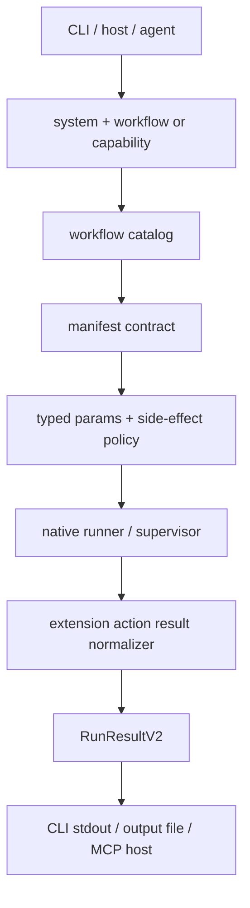

# Workflow Contract Platform

## Production Standard

The manifest-shaped JSON body is the canonical workflow contract. Do not build
new production workflow surface area around the older loose workflow JSON
shape.

Workflow files keep their existing names. For example, Google search remains
`workflows/google/google-search.json`; the JSON body is now the manifest. Do
not add `*.manifest.json`, `*.manifest.v2.json`, or other sidecar manifests for
production workflows. Old filenames are canonical because downstream callers,
catalog routing, and smoke evidence all need one stable path per workflow.

The runtime understands executable manifest `steps[]`, and strict catalog
validation uses `rzn_contracts::v2`.

Author-facing details live in
[AUTHORING_GUIDE.md](./AUTHORING_GUIDE.md).

## Instruction For Workflow-Building Agents

When building or migrating a workflow:

1. Edit the normal production workflow file, for example
   `workflows/google/google-search.json`.
2. Put `schema_version: "rzn.workflow_manifest"` in that JSON body.
3. Declare typed `params`, honest top-level and step-level `side_effects`,
   executable `steps[]`, and a `result` selector/schema.
4. Do not create `*.manifest.json`, `*.manifest.v2.json`, or V1/V2 sidecars.
5. Run `workflow inspect` and treat that output as the agent-callable contract.
6. Run strict per-file validation, strict catalog validation, and a safe normal
   route smoke before handoff.

Use the word `array` only for real list values. Scalar choices such as
`mode`, `filter`, `playlist_id`, and URLs are `string` params. File-list params
can be arrays; the CLI accepts JSON arrays, comma-separated strings, or a
single value before manifest normalization.

## Implemented Contract

| Area | Standard | Required evidence |
|---|---|---|
| Authoring target | Existing `workflows/<system>/<name>.json` files with `schema_version: "rzn.workflow_manifest"` in the JSON body. | No production sidecars and no public V1/V2 authoring path. |
| Catalog | Manifest routes are the production capability surface. | `rzn-browser workflow validate-catalog --strict --json` passes. |
| Runtime | Executable manifest `steps[]` is the primary runtime source. | Named runs resolve to the manifest route, not a parallel legacy file. |
| Policy | Side-effect declarations are part of the ABI. | Runtime enforcement blocks undeclared or unapproved side effects. |
| Envelope | Hosts consume `RunResultV2.output`. | CLI, MCP, and downstream host surfaces unwrap the same output envelope. |
| Smoke | Every shipped or changed workflow needs safe smoke evidence. | Read-only, download-heavy, authenticated, and mutating flows have route-appropriate smoke evidence or a tracked WAT follow-up. |

## Canonical Shape

The schema version is:

```json
"schema_version": "rzn.workflow_manifest"
```

Skeleton contract. Do not hand this off until `steps[]` contains executable
steps and `result.output_selector.step_id` points at a real step:

```json
{
  "schema_version": "rzn.workflow_manifest",
  "id": "google/search",
  "name": "Google Search",
  "version": "2.0.0",
  "system": "google",
  "capability": "google.search",
  "params": {
    "properties": {
      "search_query": {
        "kind": "string",
        "required": true,
        "description": "Query text."
      }
    },
    "additional_params": false
  },
  "side_effects": [
    { "class": "browser_state" },
    { "class": "read_only" }
  ],
  "runtime": {
    "actor": "supervisor",
    "timeout_ms": 90000
  },
  "steps": [],
  "result": {
    "output_selector": { "step_id": "extract", "path": "$" },
    "output_schema": { "type": "array" }
  },
  "help": {
    "summary": "Search Google and extract result rows.",
    "parameters": {
      "search_query": "Query text."
    },
    "examples": [],
    "returns": ["Array of search result rows."],
    "notes": []
  }
}
```

For new work, prefer populated `steps[]` instead of a parallel
`runtime.workflow_path`. `runtime.workflow_ref` and `runtime.workflow_path` are
transition tools for migration only.

Production sidecar manifests are not allowed. If an author needs to iterate on
a local draft, keep it out of the production catalog until it replaces the
normal workflow file.

## Runtime Flow



## Validation Surface

| Command | Purpose |
|---|---|
| `rzn-browser workflow inspect <system> <workflow>` | Human-readable input/output/effect manifest. |
| `rzn-browser workflow inspect <system> <workflow> --json` | Programmatic manifest view for hosts and agents. |
| `rzn-browser workflow validate <path-or-ref> --strict --json` | Validate one manifest file through `rzn_contracts::v2`. |
| `rzn-browser workflow validate-catalog --strict --json` | Validate every production manifest in the catalog. Fixtures are excluded. |
| `rzn-browser workflow capability list --json` | Enumerate production capability surface. |

`inspect` is the handoff surface for workflow teams. A workflow is not ready
for downstream agents if inspect cannot show its required inputs, optional
inputs, side effects, runtime actor, step count, output selector, and output
schema without reading step internals.

## Migration Policy

Maintaining two public workflow formats is not worth the cost. The production
policy is:

1. Convert existing workflow JSON files in place.
2. Make the runner execute manifest directly.
3. Stop adding new production workflows in the old loose shape.
4. Archive removed legacy-only files outside the production workflow tree.

## Side-Effect Taxonomy

Manifest declarations, runner payloads, and supervisor enforcement all use the
same contract enum:

| Class | Meaning |
|---|---|
| `read_only` | Reads page or browser-visible content without mutation. |
| `external_read` | Reads data from a remote origin or third-party URL. |
| `network_access` | Performs outbound network access outside local browser state. |
| `browser_state` | Changes tab, DOM state, navigation, focus, or session-local browser state. |
| `file_write` | Writes local files. |
| `download` | Starts or records browser downloads. |
| `external_write` | Writes to a remote service or user account. |
| `auth` | Uses or changes authentication/session state. |
| `destructive` | Deletes, posts irreversible changes, or performs high-risk mutation. |

Unknown effect names are validation errors, not warnings.

## Handoff Gate

Before a workflow is handed to downstream agents or launch-facing callers, the
bar is:

- `workflow validate-catalog --strict --json` is green with real production
  manifests, not fixtures.
- Per-file `workflow validate <path-or-ref> --strict --json` is green for
  every production workflow touched by the change.
- `workflow inspect <system> <workflow> --json` gives complete inputs,
  optionality, types, output schema, and side effects.
- There are no production `*.manifest.json` or `*.manifest.v2.json` sidecars.
- Named runs resolve to manifest where a manifest exists.
- Step calls carry `workflow_id`, `workflow_version`, `system`, `capability`,
  and enforced declared side effects.
- CLI post-processing side effects are declared too: `--output-file` requires
  `file_write`; `--download-dir` requires `download`, `file_write`,
  `external_read`, and `network_access`.
- CLI output and host consumers receive/unwrap `RunResultV2.output`, not an
  ad hoc legacy payload.
- At least one read-only workflow, one download-heavy workflow, one
  authenticated workflow, and one mutating workflow are smoked end to end for
  the changed pack or release slice. Mutating smoke must stop before irreversible submit/send/post
  unless the operator explicitly approves the write.

## Downstream Agent Acceptance

Workflow teams can hand a workflow to downstream agents only when all of these
are true:

| Check | Acceptance bar |
|---|---|
| Filename | The production file keeps the canonical old path, for example `workflows/google/google-search.json`. |
| Schema | The JSON body has `schema_version: "rzn.workflow_manifest"`. |
| Inputs | Every placeholder, script input, and runtime parameter appears in `params.properties` with type, required/default/enum/sensitive metadata. |
| Outputs | `result.output_selector` points to a real step and `result.output_schema` matches observed output. |
| Effects | Top-level and step-level side effects declare reads, external reads, network access, browser state, downloads, file writes, auth, external writes, and destructive behavior honestly. |
| Validation | Strict per-file validation and strict catalog validation pass. |
| Inspection | Plain and JSON inspect output are readable enough for an agent to call the workflow without opening the workflow file. |
| Smoke | The workflow has a safe smoke record, or a WAT task owns the remaining live-site validation. |
