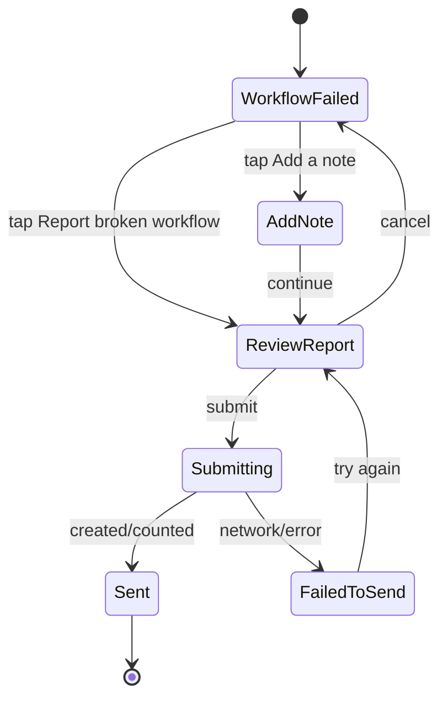

# Phone Team Spec: Workflow Failure Reporting

## Goal
Bring the same transparent workflow failure reporting model to phone-driven RZN surfaces. If a phone app starts, monitors, or displays a browser workflow and that workflow fails, the user should be able to report the broken workflow without sending private task content.

The phone UI must not say "send diagnostics" as the main action. It should say "Report broken workflow" and show the exact fields that will be sent.

## Product Principle
The user may have run a workflow involving private searches, messages, account pages, or PII. Treat them like a smart person who installed software from the internet and is deciding whether to trust it.

Default reporting rule:

```text
If the user cannot see the field on the report screen, the phone app does not send it.
```

## User Experience
Failure state:

```text
Workflow failed
google/search-v1

Failed at: search_button
Reason: button_not_found

Reporting this helps us know what broke, group similar failures, and fix the workflow faster.
```

Primary action:

```text
Report broken workflow
```

Secondary action:

```text
Add a note
```

Before submission, show:

```text
This will send:

Workflow system: google
Workflow: google/search-v1
Workflow version: 2026-04-24.1
Failed step: search_button
Error: button_not_found
App version: 0.8.3
Platform: ios

This will not send your search terms, page content, URLs, screenshots,
cookies, passwords, form values, logs, workflow inputs, or browser history.
```

If the user adds a note:

```text
Optional note
[ The page loaded, but the button never appeared. ]

Only the note you type here is included.
```

Success:

```text
Report sent
This helps us see which workflows are broken and fix them faster.
```

Duplicate/grouped success:

```text
Report counted
This workflow failure is already known. Your report helps prioritize the fix.
```

Network failure:

```text
Could not send report
You can try again later.
```

## Do Not Use
Avoid these words in primary UI:

| Avoid | Use Instead |
| --- | --- |
| Send diagnostics | Report broken workflow |
| Upload report bundle | Report broken workflow |
| Share logs | Add a note |
| Telemetry | Report |
| Last failure | This workflow |
| Crash report | Broken workflow report |

## Data Contract
The phone app should submit the same minimal payload as the CLI.

Endpoint:

```http
POST /v1/workflow-failure-reports
Content-Type: application/json
```

Payload:

```json
{
  "schema_version": 1,
  "source": "rzn-phone",
  "mode": "explicit_minimal",
  "system": "google",
  "workflow": "google/search-v1",
  "workflow_version": "2026-04-24.1",
  "failed_step": "search_button",
  "error": "button_not_found",
  "app_version": "0.8.3",
  "platform": "ios"
}
```

With note:

```json
{
  "schema_version": 1,
  "source": "rzn-phone",
  "mode": "explicit_minimal",
  "system": "google",
  "workflow": "google/search-v1",
  "workflow_version": "2026-04-24.1",
  "failed_step": "search_button",
  "error": "button_not_found",
  "app_version": "0.8.3",
  "platform": "ios",
  "note": "The page loaded, but the button never appeared."
}
```

Response:

```json
{
  "ok": true,
  "report_id": "wfr_01J...",
  "group_id": "wfg_01J...",
  "status": "counted"
}
```

## Required Inputs From Browser/Tools Runtime
The phone app should not derive failure fields from raw logs or hidden traces. The workflow runtime should provide a safe failure summary object to the phone surface.

Safe failure summary:

```json
{
  "system": "google",
  "workflow": "google/search-v1",
  "workflow_version": "2026-04-24.1",
  "failed_step": "search_button",
  "error": "button_not_found",
  "app_version": "0.8.3",
  "platform": "ios"
}
```

The phone app must not request or submit:

| Forbidden | Examples |
| --- | --- |
| Workflow inputs | search terms, prompts, account names, form text |
| Browser data | URL, title, visible text, DOM, screenshot |
| Secrets | cookies, local storage, auth headers, passwords |
| Logs | native logs, extension logs, LLM prompts/responses |
| Hidden local ids | run id, trace id, local report bundle path |

## UI States
State machine:



Screen requirements:

| Screen | Must Show | Must Not Show |
| --- | --- | --- |
| Failure | workflow, step, error, value prop | raw exception, URL, params |
| Review | exact submitted fields, privacy exclusion list | hidden "diagnostics" checkbox |
| Add note | user-authored text box, max length | auto-filled page data |
| Success | grouped/count status if available | promise of personal follow-up |

## Copy
Use this exact value proposition:

```text
Reporting this helps us know what broke, group similar failures, and fix the workflow faster.
```

Use this privacy statement, adjusted only for layout:

```text
This does not send your search terms, page content, URLs, screenshots, cookies,
passwords, form values, logs, workflow inputs, or browser history.
```

Do not promise direct updates unless the phone app explicitly collects a notification channel and the backend supports it.

## Offline Behavior
If the phone is offline:
- Keep the report unsent only if the user explicitly taps submit.
- Store only the same visible fields and optional note.
- Show "Waiting to send" with a cancel option.
- Do not queue hidden diagnostics.

Queued report storage should expire after 7 days.

## Acceptance Criteria
- User can see every submitted field before tapping submit.
- Default phone report contains no workflow inputs, URLs, DOM, screenshots, cookies, logs, prompts, responses, or hidden ids.
- The primary action is "Report broken workflow."
- The value proposition appears before submission.
- Optional notes are user-authored and clearly labeled.
- Backend receives the same schema as CLI with `source = rzn-phone`.
- Duplicate reports are grouped by backend fingerprint, not by phone-side issue creation.
