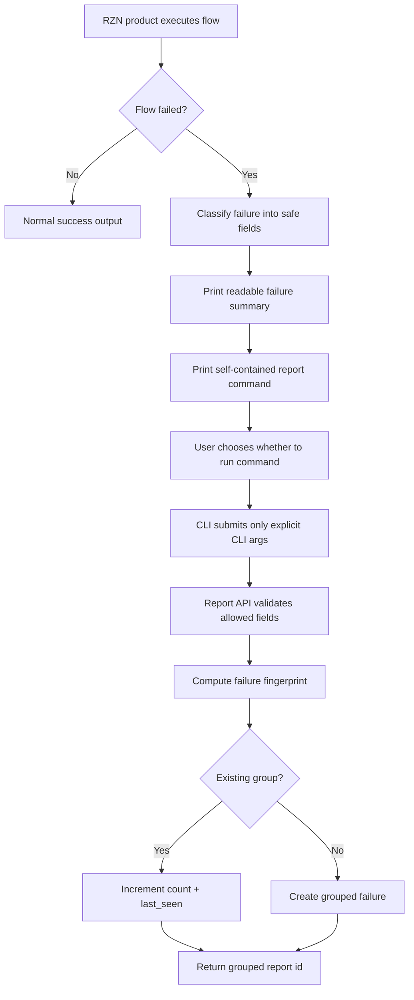

# Flow Failure Reporting

## Overview
Goal: when any shipped RZN flow fails, print a transparent, copy-pasteable report command that lets the user tell RZN exactly which product and flow broke and where it broke, without sending private inputs, browser data, logs, screenshots, DOM, cookies, URLs, sandbox files, tool arguments, or hidden local state. The report backend groups duplicate failures across browser workflows, phone automation, prebuilt tools, and the Python sandbox so the team can see what is broken, prioritize fixes, and ship updates faster.

Constraints: the default command must be human-readable and self-contained; if the user cannot see a field in the command, the command must not send it. No opaque tokens, no `last failure` command, no `run_id`, no hidden report bundle, and no "diagnostics" language in the default path. Optional user-authored notes are allowed because the user writes the text themselves. Richer debug modes can exist later, but they must be separate, previewable, and never framed as the recommended path.

## Flow Diagrams
End-to-end default reporting flow:



Trust boundary:

```text
Workflow runtime may know private things:
  params, search terms, URLs, DOM, page text, cookies, screenshots, logs

Failure report command may only include visible, non-private fields:
  product, flow kind, surface, flow, version, stage, error, app version, platform

Hard line:
  if it is not printed as a CLI argument, default reporting does not send it.
```

Default terminal UX:

```text
Workflow failed: google/search-v1
Failed at: search_button
Reason: button_not_found

Reporting this helps us know what broke, group similar failures, and fix the workflow faster.

Report this broken workflow:
  rzn-browser report workflow-broken \
    --product rzn-browser \
    --flow-kind workflow \
    --system google \
    --workflow google/search-v1 \
    --version 2026-04-24.1 \
    --step search_button \
    --error button_not_found \
    --app-version 0.8.3 \
    --platform macos

This command sends exactly the fields shown above.
It does not read your browser, page content, search terms, form values, cookies,
screenshots, logs, workflow inputs, or browser history.

Optional, if you want to add context in your own words:
  rzn-browser report workflow-broken \
    --product rzn-browser \
    --flow-kind workflow \
    --system google \
    --workflow google/search-v1 \
    --version 2026-04-24.1 \
    --step search_button \
    --error button_not_found \
    --app-version 0.8.3 \
    --platform macos \
    --note "The page loaded, but the button never appeared."
```

## Decision Record
- Use an explicit `rzn-browser report workflow-broken ...` command instead of `report last-failure`. `last-failure` implies hidden local logging and feels creepy to a non-technical user who just ran a workflow containing private information.
- Do not use opaque JWT-like tokens. Even if technically safe, they look like secret upload handles. The command must be readable by a normal user.
- Do not pass `run_id`. It is developer-shaped, not user-shaped, and it encourages the command to dereference stored local context.
- Do not call the default path telemetry, diagnostics, crash reports, traces, or bundles. Those words have been poisoned by years of software uploading too much.
- Do use `workflow-broken` language. It describes exactly what the user is reporting.
- Do include a value proposition before the command: reporting helps us know what broke, group similar failures, and fix the workflow faster.
- Do route public intake to a hosted report API, not GitHub Issues. Non-technical users may not have GitHub accounts, and public issues are a terrible place for accidental private context.
- Use the existing RZN backend as the intake system of record. It already has migrations, database access, deployment, and future maintainer UI surfaces; a standalone Cloudflare Worker would add another place to debug and migrate.
- Put Cloudflare in front as a shield, not as the source of truth: bot checks, coarse rate limits, and WAF rules at the edge; strict validation, dedupe, counting, and note storage in the backend.
- Backend dedupe owns duplicate consolidation. The CLI should stay simple and submit one report; the server groups it.
- Richer debug modes are not part of the recommended command. If they exist, they must be named explicitly, show a preview, and require separate confirmation.

## Architecture
Modules and ownership:

| Area | Owner | Responsibility |
| --- | --- | --- |
| Flow failure classifier | Owning product team | Convert raw runtime failures into safe fields: `product`, `flow_kind`, `surface`, `flow`, `version`, `stage`, `error` |
| CLI failure renderer | Tools team | Print the summary, value proposition, report command, and privacy statement |
| Report command | Tools team | Submit only explicit args to the hosted report API |
| Report API | Backend/tools infra | Validate payload, rate-limit, dedupe, store counts and user notes |
| Maintainer queue | Tools/backend | Show grouped failures by count, version, recency, product, and flow |
| Phone app integration | Phone team | Show the same transparent fields and submit the same payload contract from mobile surfaces |

Shared product taxonomy:

| Product | Source | Flow kind | Example flow |
| --- | --- | --- | --- |
| `rzn-browser` | `rzn-browser-cli` | `workflow` | `google/search-v1` |
| `rzn-phone` | `rzn-phone` | `phone_automation` | `ios/messages-send-v1` |
| `rzn-tools` | `rzn-tools` | `tool` | `gmail/send-email-v1` |
| `rzn-python-sandbox` | `rzn-python-sandbox` | `python_sandbox` | `python/execute-v1` |

Browser CLI surface:

```bash
rzn-browser report workflow-broken \
  --product rzn-browser \
  --flow-kind workflow \
  --system <system> \
  --workflow <system/workflow-id> \
  --version <workflow-version-or-hash> \
  --step <failed-step-id-or-index> \
  --error <stable-error-code> \
  --app-version <semver> \
  --platform <platform> \
  [--note <user-authored-note>]
```

Rules for the report command:

| Rule | Requirement |
| --- | --- |
| Self-contained | Command submission may use only arguments supplied in the command plus the endpoint URL baked into the binary. |
| No hidden reads | The default command must not read run logs, trace files, browser state, local failure caches, workflow inputs, environment secrets, or extension state. |
| No silent enrichment | If app version, platform, browser, or extension version are sent, they must be printed as explicit args. |
| Stable schema | Unknown flags should fail locally instead of being passed through. |
| User note | `--note` is allowed; trim to a backend-defined max length and store separately from grouped metadata. |
| Output | Return a report/group id and whether this was a new group or counted against an existing group. |

Report API endpoint:

```http
POST /v1/flow-failure-reports
Content-Type: application/json
```

`POST /v1/workflow-failure-reports` remains as a browser compatibility alias.

Minimal payload:

```json
{
  "schema_version": 1,
  "source": "rzn-browser-cli",
  "mode": "explicit_minimal",
  "product": "rzn-browser",
  "flow_kind": "workflow",
  "surface": "google",
  "flow": "google/search-v1",
  "flow_version": "2026-04-24.1",
  "failed_stage": "search_button",
  "error": "button_not_found",
  "app_version": "0.8.3",
  "platform": "macos"
}
```

Payload with user note:

```json
{
  "schema_version": 1,
  "source": "rzn-browser-cli",
  "mode": "explicit_minimal",
  "product": "rzn-browser",
  "flow_kind": "workflow",
  "surface": "google",
  "flow": "google/search-v1",
  "flow_version": "2026-04-24.1",
  "failed_stage": "search_button",
  "error": "button_not_found",
  "app_version": "0.8.3",
  "platform": "macos",
  "note": "The page loaded, but the button never appeared."
}
```

Fields explicitly forbidden in the default schema:

| Forbidden field class | Examples |
| --- | --- |
| Flow inputs | search terms, prompts, tool args, usernames, file paths, form values, sandbox code |
| Page data | URLs, titles, visible text, DOM, accessibility tree, screenshots |
| Browser secrets | cookies, local storage, session storage, auth headers, browser history |
| Logs and traces | unified log lines, step stdout/stderr, LLM prompts, LLM responses |
| Local identifiers | `run_id`, trace file path, hidden local report id, opaque token |

Backend dedupe fingerprint:

```text
sha256(
  schema_version,
  product,
  flow_kind,
  surface,
  flow,
  flow_version,
  failed_stage,
  error
)
```

Backend storage model:

```text
flow_failure_groups
  fingerprint TEXT PRIMARY KEY
  product TEXT NOT NULL
  flow_kind TEXT NOT NULL
  surface TEXT NOT NULL
  flow TEXT NOT NULL
  flow_version TEXT NOT NULL
  failed_stage TEXT NOT NULL
  error TEXT NOT NULL
  count INTEGER NOT NULL DEFAULT 1
  notes_count INTEGER NOT NULL DEFAULT 0
  app_versions_json TEXT NOT NULL
  platforms_json TEXT NOT NULL
  first_seen_at TEXT NOT NULL
  last_seen_at TEXT NOT NULL

flow_failure_notes
  id TEXT PRIMARY KEY
  fingerprint TEXT NOT NULL
  note TEXT NOT NULL
  source TEXT NOT NULL
  created_at TEXT NOT NULL
```

Backend response:

```json
{
  "ok": true,
  "report_id": "wfr_01J...",
  "group_id": "ffg_01J...",
  "status": "counted"
}
```

Rate limiting and spam control:

| Layer | Rule |
| --- | --- |
| Backend validation | Reject unknown fields, oversized values, malformed workflow ids, and notes over max length. |
| Fingerprint grouping | Increment existing failure group instead of creating duplicates. |
| IP/rate limit | Use Cloudflare rate limiting for edge abuse and backend counters per coarse hashed IP bucket plus fingerprint bucket. |
| Note sampling | Store all notes at low volume; at high volume, cap notes per fingerprint per day. |
| Abuse response | Return success-like counted response for harmless duplicates; hard-reject malformed or abusive payloads. |

## Implementation Notes
Failure classification:
- Each product runner should classify errors into stable error codes before rendering the report command.
- Suggested initial error codes: `button_not_found`, `element_not_found`, `element_not_clickable`, `input_not_found`, `timeout`, `navigation_failed`, `extension_disconnected`, `native_host_disconnected`, `auth_required`, `blocked_by_captcha`, `unknown_failure`.
- `failed_stage` should prefer a product-authored stable stage id. Browser workflows can use a workflow step id; if missing, use `step_<index>_<action>`, for example `step_4_click`.
- `flow_version` should be a catalog version, release version, or content hash. Human-readable release versions are better in the command; the backend can map to hashes later if needed.

CLI rendering:
- Print the report block only for workflow failures, not for invalid CLI usage or local setup errors unless the error can be attributed to a workflow.
- Keep the privacy statement adjacent to the command. Do not bury it in docs.
- Do not print more than two commands in the default failure output. One recommended report command and one optional note variant are enough.
- Avoid `--yes`, `--diagnostics`, `--last`, `--run-id`, `--trace`, or `--bundle` in the default failure output.

Report submission:
- The command should submit immediately because the user already chose to run the explicit visible command.
- Print the outgoing fields before the network call only if `--dry-run` is provided. Do not require confirmation for the default explicit command; the command itself is the disclosure.
- Network failures should not make the workflow failure worse. Print one soft line that the report was not sent and exit successfully.
- The endpoint URL should be configurable by env var for staging, but production builds should default to the production report API.

Optional future surfaces:
- `rzn-browser report workflow-broken --dry-run ...` can preview the JSON payload without sending.
- `rzn-browser report workflow-broken --note "..." ...` stores user-authored context.
- `rzn-browser report workflow-broken --include-diagnostics` is not recommended for v1. If added later, it must preview exactly what will be sent and must never be emitted as the recommended command.

## Tasks & Status
- [x] Add `report workflow-broken` CLI subcommand.
- [x] Add safe workflow failure classifier.
- [x] Render self-contained report command on workflow failure.
- [x] Add privacy copy and value proposition to failure output.
- [x] Add unit tests proving default report command does not read hidden local state.
- [x] Add backend intake endpoint.
- [x] Add backend schema and migration for grouped failures and notes.
- [x] Add backend validation, fingerprinting, dedupe, and rate limiting.
- [ ] Add maintainer query/view for top broken workflows.
- [ ] Add phone-team integration using the same payload contract.
- [ ] Add docs for public privacy behavior.

## Tools Team Handoff
See [TOOLS_TEAM_SPEC.md](./TOOLS_TEAM_SPEC.md) for command grammar, runtime classification, tests, and rollout sequencing.

## Phone Team Handoff
See [PHONE_TEAM_SPEC.md](./PHONE_TEAM_SPEC.md) for the mobile UI contract, copy, API payload, and privacy constraints.

## What Works (Do Not Change)
- The report command is explicit and self-contained.
- The recommended path sends only fields visible in the command.
- No `last failure`, `run_id`, opaque token, hidden bundle, full logs, DOM, screenshots, URLs, or workflow inputs in the default path.
- The copy says reporting helps us know what broke, group similar failures, and fix the workflow faster.
- Backend dedupe groups reports by workflow identity, version, failed step, and error.

## Tried & Didn’t Work
- `rzn-browser report last-failure`: too opaque. It implies hidden logging and makes privacy-conscious users bounce.
- JWT-like or base64 report tokens: technically convenient, but they look suspicious and destroy trust.
- `run_id`-based reporting: encourages dereferencing stored local artifacts, which is exactly the wrong mental model.
- GitHub Issues as intake: bad for non-technical users and unsafe for accidental private context.
- "Send diagnostics" wording: users read it as "upload whatever the app wants." They are not wrong.
