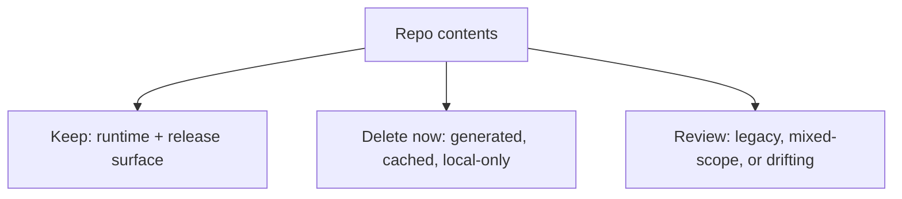

# Repo Cleanup Audit

Investigation only. No deletions were performed in this pass.

## Current shape

## Biggest space hogs

| Path | Approx size | Take |
| --- | ---: | --- |
| `target/` | 506 MB | Delete now; build output |
| `extension/` | 263 MB | Keep source, delete caches/output |
| `crates/` | 2.2 MB | Core runtime |
| `docs/` | 2.0 MB | Mixed: keep scratchpads, trim generated/drift |
| `.beads/` | 1.6 MB | Delete now if Beads is gone |
| `workflows/` | 1.4 MB | Mixed: shipped catalog + tests/generated |

## Buckets

| Bucket | Meaning | File |
| --- | --- | --- |
| `Delete Now` | Safe to remove without changing product scope | [delete_now.md](./delete_now.md) |
| `Review First` | Probably removable or splittable, but tied to feature scope or release flow | [review_before_delete.md](./review_before_delete.md) |
| `Keep Core` | Active runtime, packaging, and test surfaces | [keep_core.md](./keep_core.md) |

## Strong take

The repo is not bloated because Rust crates exist. It is bloated because generated artifacts, local machine state, legacy experiments, and mixed-scope workflow packs are sitting next to the real product.

If you want a sharp cleanup pass later, do it in this order:

1. Delete everything in `delete_now.md`.
2. Fix ignore rules so the same junk does not crawl back in.
3. Make explicit product-scope calls on `review_before_delete.md`.
4. Only then prune crates, workflows, and docs that no longer match the narrower repo story.

## Notes from the audit

- Bun is the real JS toolchain. `pnpm` looks like residue.
- `rzn-browser`, `rzn-native-host`, `rzn_plan`, `rzn_core`, and `rzn_contracts` are the live spine.
- `rzn_broker` and `rzn_eval` are the main Rust “are we still doing this?” candidates.
- `workflows/generated/` is inconsistent: some of it is debug junk, some of it is actively used ASO workflow content.
- `docs/index/` is generated and can be rebuilt; `docs/features/` is the real documentation source of truth.
