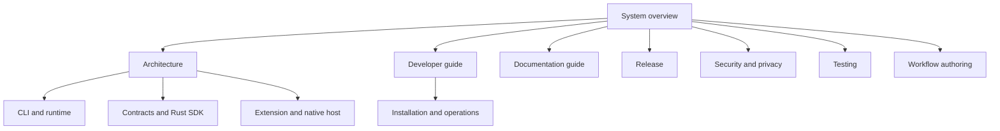

# System overview

RZN Browser runs browser tasks on a local machine. It uses a browser profile
that you own. A workflow is a JSON description of a repeatable task.

The normal execution path is:

```text
CLI run
  -> native runner
  -> workflow runner
  -> supervisor local socket
  -> native host
  -> extension service worker
  -> content script or CDP
  -> page
```

The supervisor owns local readiness, browser targets, runs, settings, and
workflow execution. The native host is a browser-launched transport shim. The
extension performs browser work. Cloud and fleet code coordinate machines that
you own; they do not replace the local browser path.

Read the pages in this order:

1. [Architecture](architecture.md)
2. [CLI and runtime](cli-runtime.md)
3. [Extension and native host](extension-native-host.md)
4. [Contracts and Rust SDK](contracts-sdk.md)
5. [Workflow authoring](workflow-authoring.md)
6. [Installation and operations](installation-operations.md)
7. [Testing](testing.md)
8. [Release](release.md)
9. [Security](security.md)

The command list is defined by [`main.rs`](../../crates/rzn_browser/src/main.rs).
The runtime path is defined by [`native_runner.rs`](../../crates/rzn_browser/src/native_runner.rs),
[`workflow_runner`](../../crates/rzn_browser/src/workflow_runner/), and
[`supervisor.rs`](../../crates/rzn_browser/src/supervisor.rs).

<!-- tusker:docs-map:begin -->

<!-- tusker:docs-map:end -->
