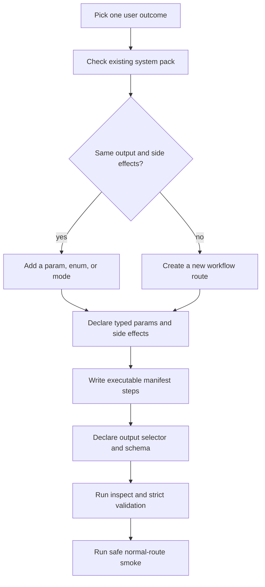

# Workflow Manifest Authoring Gate

Audience: workflow authors and agents creating or migrating browser workflow
packs.

The production standard is one workflow file with a manifest-shaped JSON body.
Agents call a route/capability exposed by the catalog, but the implementation
still lives at the normal path such as `workflows/google/google-search.json`.
Do not create production `*.manifest.json` or `*.manifest.v2.json` sidecars.

## Authoring Flow

## Manifest Checklist

| Area | Required | Rejection examples |
|---|---|---|
| Identity | `schema_version`, `id`, `name`, `version`, `system`, `capability` | sidecar-only metadata, V1/V2 file pairs, hidden aliases |
| Parameters | `params.properties` with kind, required/default, enum, sensitivity where needed | prose-only params, unknown extra params, scalar ids marked as arrays |
| Effects | top-level and step-level side effects using the contract taxonomy | hidden file writes, implicit submit/send/post, downloads without `download` + `file_write` |
| Runtime | `runtime.actor`, timeout, and `requires_existing_session` only when needed | active-tab fields in production JSON |
| Steps | executable `steps[]` with stable ids and known action kinds | parallel legacy runtime files as the source of truth |
| Output | `result.output_selector` and `result.output_schema` | final output guessed from the last browser payload |
| Help | human-facing summary, params, examples, returns, notes | help used as the machine contract |

## Capability Split Rule

Split only when the caller must reason about a different contract.

| Keep together | Split |
|---|---|
| same result shape with a `mode` enum | read-only extraction vs remote write |
| same side-effect class with optional params | search results vs image download artifacts |
| same resource with different filters | draft-only vs live submit if policy differs |

If the only reason to split is "the old engine cannot express this cleanly",
fix the engine or the manifest action taxonomy. Duplicate workflow tools are
how catalogs become junk drawers.

## Parameter Rule

Use the narrowest honest type:

- scalar choices and ids are `string`
- counters are `integer`
- toggles are `boolean`
- structured bags are `object`
- true lists are `array`

The CLI accepts array params as JSON arrays, comma-separated strings, or a
single value. That is caller convenience, not permission to mark scalar fields
as arrays.

## Side-Effect Policy

Declare every effect the runtime or user must care about:

| Effect | Meaning |
|---|---|
| `read_only` | Reads page or browser-visible content without mutation. |
| `external_read` | Reads data from a remote origin or third-party URL. |
| `network_access` | Performs outbound network access outside local browser state. |
| `browser_state` | Changes tab, DOM state, navigation, focus, or session-local browser state. |
| `file_write` | Writes local files. |
| `download` | Starts or records browser downloads. |
| `external_write` | Writes to a remote service or user account. |
| `auth` | Uses or changes authentication/session state. |
| `destructive` | Deletes, posts irreversible changes, or performs high-risk mutation. |

## JavaScript Steps

`execute_javascript` exposes positional `args` as `arg0` through `arg9`, plus
the full `args` array and `__rzn_params`. Prefer named values from
`__rzn_params` for anything non-trivial; use positional args only for compact
step-local values. A thrown script error is a failed step, not a successful
null result.

## Acceptance Gate

A workflow is acceptable when all rows pass:

| Gate | Command / proof | Owner |
|---|---|---|
| Structural validation | `rzn-browser workflow validate <path-or-ref> --strict --json` returns zero errors | workflow author |
| Inspectability | `rzn-browser workflow inspect <system> <workflow> --json` exposes inputs, effects, runtime, and output | workflow author |
| Catalog validation | `rzn-browser workflow validate-catalog --strict --json` stays green | workflow author |
| Side-effect review | declared effects match actual steps, including hidden JS/download/file behavior | reviewer |
| Output review | primary result contains caller-useful fields; artifacts are refs, not blobs | reviewer |
| Live proof | normal-route run succeeds or stops at the documented approval gate | workflow author |
| Docs | pack README/help examples match route, typed params, and side effects | workflow author |

## Fixture Namespace

Use `workflows/fixtures/` only for ABI or regression examples. Fixture manifests
are not production catalog entries and must not power capability discovery.
