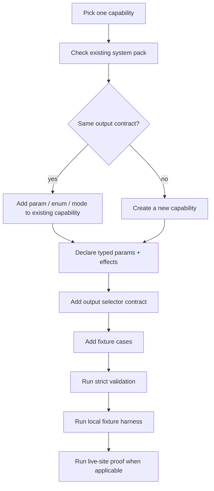

# ManifestV2 Workflow Authoring Gate

Audience: workflow authors converting or creating browser workflow packs after the Workflow Contract Platform validator exists.

ManifestV2 makes one sharp change: agents call capabilities, not filenames. A workflow file is an implementation detail behind a manifest-declared `system_id` and `capability_id`.

## Authoring Flow

## Manifest Checklist

| Area | Required | Rejection examples |
|---|---|---|
| Identity | `schema_version`, `system_id`, `workflow_id`, one or more `capability_id` entries | filename-only routing, aliases that silently redirect |
| Parameters | JSON-schema-like typed params, required list, defaults, enum choices where applicable | prose-only params, permissive `additionalProperties`, booleans for multi-mode choices |
| Effects | explicit read/write/download/auth/storage/code-execution declarations | hidden file writes, implicit submit, `execute_javascript` without code-execution policy |
| Output | declared status/result/warning/artifact/debug selectors | final output chosen by last payload, raw browser action response as API output |
| Fixtures | at least one success case and one failure/policy case for non-trivial capabilities | live-site-only validation, screenshots as the only proof |
| Help | human-facing summary, params, examples, returns, notes | help used as the machine contract |

## Capability Split Rule

Split only when the caller must reason about a different contract.

| Keep together | Split |
|---|---|
| same result shape with a `mode` enum | read vs external write |
| same side-effect class with optional params | search results vs image download artifacts |
| same resource with different filters | draft-only vs live submit if policy differs |

If the only reason to split is "the old engine cannot express this cleanly", fix the engine. Shipping duplicate tools because the runtime is awkward is how catalogs become junk drawers.

## Side-Effect Policy

Declare every effect the runtime or user must care about:

| Effect | Meaning | Gate |
|---|---|---|
| `read` | reads page or remote data | allowed by default |
| `draft` | fills UI but stops before submission | may require user-visible review |
| `external_write` | posts, sends, comments, purchases, deletes, or mutates remote state | explicit approval/policy |
| `download` | writes a downloaded artifact | artifact contract + path policy |
| `local_file_write` | writes a local file outside the browser download primitive | path policy |
| `auth_required` | requires logged-in browser state | setup/capability check |
| `storage_mutation` | changes cookies, local storage, session state, extension storage | explicit declaration |
| `code_execution` | runs page JavaScript, injected scripts, or local code | explicit policy and redacted debug |

## JavaScript Steps

`execute_javascript` exposes positional `args` as `arg0` through `arg9` in every eval backend, plus the full `args` array and `__rzn_params` object. Prefer named values from `__rzn_params` for anything non-trivial; use positional args only for compact step-local values. A thrown script error is a failed step, not a successful null result, so author tests should assert both the success path and one intentional throw.

## Acceptance Gate

A workflow pack is acceptable when all rows pass:

| Gate | Command / proof | Owner |
|---|---|---|
| Structural validation | `rzn-browser workflow validate --strict <manifest-or-pack>` returns zero errors | workflow author |
| Fixture contract | fixture harness returns stable `RunEnvelopeV1` snapshots | workflow author |
| Side-effect review | effects match actual steps, including hidden JS/download/file behavior | reviewer |
| Output review | primary result contains only caller-useful fields; artifacts are refs, not blobs | reviewer |
| Live proof | live-site workflow run succeeds or stops at the documented approval gate | workflow author |
| Docs | system README/help examples match capability route and typed params | workflow author |

Do not convert a production pack broadly until the strict validator and fixture harness exist. Drafting pilot manifests is fine; pretending they are validated is not.

## Pilot Fixture Namespace

Use `workflows/fixtures/manifest_v2/` for ABI examples while the validator is under construction. These files are examples for the contract harness, not old-runtime workflow JSON.
