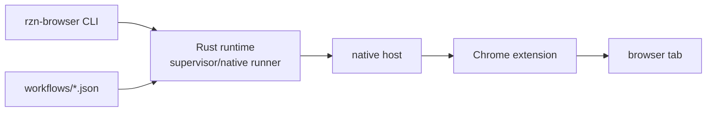

# Codebase canon

## Read this when

Read this before making broad changes, onboarding to the repo, choosing where code belongs, or deciding the right test/build command for a change.

## Do not read this when

Do not use this for exact API behavior if a source file or schema says otherwise. Do not use it as workflow authoring policy; read [[workflow/CANON]].

## Current model

`rzn-browser` is a Rust workspace plus a Chrome MV3 extension for stealth-first browser automation. It ships a CLI, local browser runtime pieces, workflow catalog, agent skills, schemas, release scripts, and examples.

The product path is local browser automation through the user's normal Chrome profile:

## Repository map

| Path | Responsibility |
|---|---|
| `crates/rzn_browser` | Main CLI binary, workflow catalog, native/supervisor runners, MCP browser mode, cloud commands, skill installer, result formatting. |
| `crates/rzn_contracts` | Versioned wire/schema contracts, including workflow manifest v2 and run result v2. |
| `crates/rzn_core` | Core action DSL, executor glue, schema-generated types, and shared errors. |
| `crates/rzn_plan` | LLM planning, action surface helpers, self-healing/planning support. |
| `crates/rzn_sdk` | SDK facade for host-side integration and native-host utility features. |
| `crates/rzn_native_host` | Chrome native messaging host; forwards extension messages to supervisor or legacy bridge. |
| `crates/rzn_browser_worker` | Legacy browser bridge/worker surface. Keep compatibility scoped. |
| `crates/rzn_broker_endpoint` | Endpoint-file utilities and stale pid/socket pruning. |
| `crates/rzn_plugin_devkit` | Plugin bundle packaging/signing utilities. |
| `extension` | MV3 extension source, Vite builds, Vitest tests, Playwright e2e, built `dist-*` outputs. |
| `workflows` | Shipped workflow packs. Production files should be manifest-shaped JSON. |
| `schema` | Canonical JSON schemas consumed by runtime/extension/codegen. |
| `skills` | Agent skills for using or building RZN workflows. |
| `docs/features` | Feature scratchpads and architecture decisions. Required for feature work by root `AGENTS.md`. |
| `scripts` | Build, release, guards, catalog, and helper tooling. Check nested `AGENTS.md` under `scripts/bundle` before editing there. |
| `tusker` | V6 repo-local knowledge graph, tasks, evidence, and closeout state. |

## Build and test map

Use the narrowest gate that proves the change:

| Change area | Primary checks |
|---|---|
| Whole repo sanity | `make build`, `make test` |
| Rust compile | `cargo build --release` or narrower `cargo check -p <crate>` |
| Rust tests | `cargo test` or `cargo test -p <crate>` |
| Extension build | `cd extension && bun run build` |
| Extension unit tests | `cd extension && bun x vitest` |
| Extension e2e | `cd extension && bun x playwright test` only for repo-owned e2e tests |
| Workflow file | `rzn-browser workflow validate <path-or-ref> --strict --json`, `workflow inspect`, `validate-catalog`, then live `rzn-browser run` smoke |
| Runtime/manual browser path | Existing Chrome session with installed extension/native host; do not silently switch to Playwright |

`rtk` is requested by repo guidance for noisy commands, but if it is unavailable in the shell, keep commands scoped and report the gap.

## Safe-change rules

- Work directly on `main` unless the human explicitly asks for a branch.
- Do not run mutating git operations unless explicitly requested.
- Do not revert user changes.
- Read source before editing; feature docs are helpful but code is final authority.
- Every feature must have a scratchpad under `docs/features/<feature>/README.md` with the required sections from `AGENTS.md`.
- For workflow/tool surfaces, follow the root "Tool & Workflow Design Rules": consolidate, sharpen descriptions, validate, and run end-to-end.
- Do not add site-specific selectors or domain-tuned routing rules to generic code paths. Improvements must come from inventory/observation layers or generic heuristics.
- Keep runtime/browser automation tests on the real extension/native-host path unless the task is explicitly a Playwright test.
- Do not edit generated files under `tusker/_system/generated/**` or generated docs-site output.

## Invariants

- Source code and schemas are the final authority for exact behavior.
- Feature docs should stay current with user-facing architecture and known runtime boundaries.
- Runtime/browser work must preserve the real Chrome extension/native-host product path.
- Repo-local task tracking lives in Tusker; git history is not a substitute for evidence and verification notes.

## Current defaults

- Rust edition is 2021 across crates.
- Main binary is `rzn-browser` from `crates/rzn_browser/src/main.rs`.
- Extension is TypeScript/Vite with 2-space style and built Chrome/Firefox manifests.
- Release profile optimizes for small binaries: LTO, one codegen unit, strip, `opt-level = "z"`.
- Installer puts runtime assets under platform-local RZN directories and registers native messaging.

## Deprecated behavior

- Treating `rzn-browser-worker` or `broker_endpoint_v1.json` as current runtime authority is deprecated.
- Ad hoc workflow JSON without manifest contracts is migration-only.
- Broad repo changes without a focused verification map are not acceptable closeout.

## Source of truth

- Repo policy: `AGENTS.md`
- Product overview/install: `README.md`
- Workspace/crate shape: `Cargo.toml`, `crates/**/Cargo.toml`
- Extension build/test: `extension/package.json`, `extension/vite.config.*.ts`, `extension/playwright.config.ts`
- Feature architecture: `docs/features/**`
- Workflow standard: [[workflow/CANON]]
- Runtime standard: [[runtime/CANON]]

## Open questions

- Which older docs under `docs/` should be deprecated once Tusker V6 canon is trusted.
- How aggressively to remove legacy workflow/runtime paths after supervisor and manifest migrations complete.
- Whether public docs export should publish Tusker domain canon directly or keep it internal/agent-only.

## Related

- [[codebase/INDEX]]
- [[runtime/CANON]]
- [[workflow/CANON]]
- [[schema/CANON]]

## Recent changes

<!-- tusker:backrefs:begin -->
- [[OPS-T-0002]] - Replaced generated scaffold with source-backed codebase canon.
<!-- tusker:backrefs:end -->
