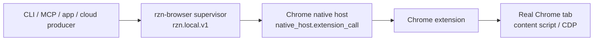

# Runtime canon

## Read this when

Read this before changing browser execution, supervisor behavior, native messaging, worker compatibility, session routing, heal/status commands, extension bridge timeouts, CDP leases, or local runtime install paths.

## Do not read this when

Do not use this as a workflow authoring guide; read [[workflow/CANON]] and `docs/workflows/AGENT_PLAYBOOK.md` for workflow JSON. Do not use task files as canon unless this page sends you to a task for proof.

## Current model

`rzn-browser` is converging on one durable local runtime owner: `rzn-browser supervisor`. The Chrome extension remains mandatory because it executes inside the user's real Chrome profile. The Chrome native host remains mandatory because it is Chrome's local bridge to native code. The supervisor is the intended state authority for CLI, MCP, app, and cloud producers.

Current code is in a migration state:

| Component | Current role | Target boundary |
|---|---|---|
| `rzn-browser run` | CLI entrypoint; default backend is `--via supervisor`; can still run native/desktop paths. | Short-lived producer that submits work and formats output. |
| `rzn-browser supervisor` | Local socket server using `rzn.local.v1`; owns status, `ensure_ready`, heal, sessions, native-host bridge registration, and optional legacy worker fallback. | Durable local runtime authority. |
| `rzn-native-host` | Chrome-owned process that forwards extension frames upstream. It prefers supervisor endpoints and keeps legacy worker bridge compatibility. | Thin extension-to-supervisor bridge only. |
| Chrome extension | MV3 browser actor. Background script talks to native host, routes tabs, manages CDP leases, and dispatches content/page actions. | Browser execution and observation only. |
| `rzn-browser-worker` | Legacy long-lived browser bridge and MCP-ish tool surface used as fallback. | Retire as durable authority after supervisor path is complete. |
| `rzn_broker_endpoint` | Legacy endpoint-file utilities for worker socket/token discovery and stale endpoint pruning. | Compatibility hint, never authority without live handshake. |

The default runtime path should be:

## Runtime protocol and paths

- Local supervisor protocol is `rzn.local.v1`.
- Default supervisor files are under the app base:
  - `run/rzn-supervisor.sock`
  - `secure/rzn-supervisor-token-v1`
- `SupervisorConfig::app_base_dir()` resolves from `RZN_SUPERVISOR_APP_BASE`, `RZN_NATIVE_APP_BASE`, `RZN_APP_BASE`, `APP_BASE`, then platform default app data.
- Native-host supervisor overrides are `RZN_LOCAL_RUNTIME_SOCKET_PATH`, `RZN_LOCAL_RUNTIME_TOKEN_PATH`, `RZN_SUPERVISOR_SOCKET_PATH`, and `RZN_SUPERVISOR_TOKEN_PATH`.
- Legacy bridge overrides are `RZN_BROWSER_BRIDGE_SOCKET_PATH` and `RZN_BROWSER_BRIDGE_TOKEN_PATH`.

Cached endpoint files such as `broker_endpoint_v1.json` may be read or pruned for migration, but a pid/socket path is not authority until the process answers the expected handshake.

## Supervisor methods

The implemented supervisor dispatch includes:

| Method/tool | Responsibility |
|---|---|
| `runtime.hello` / `runtime.status` | Return protocol, pid, app base, socket/token paths, proxy mode, and bridge status. |
| `runtime.ensure_ready` | Prune stale legacy endpoints, wait for native-host bridge, optionally probe extension readiness. |
| `runtime.heal` | Run explicit repair/readiness checks with longer bridge waits and structured diagnostics. |
| `runtime.shutdown` | Stop the supervisor loop. |
| `rzn.supervisor.health` | Tool-compatible health view. |
| `rzn.worker.health` / `rzn.worker.shutdown` | Legacy worker compatibility surface. |
| `browser.session_open`, `browser.execute_step`, `browser.snapshot`, `browser.poll_events`, `browser.session_close` | Browser tool calls. Prefer native-host bridge; only call legacy worker when fallback is explicitly allowed. |

`allow_legacy_worker_fallback` is intentionally explicit. It can be set by CLI flag or `RZN_SUPERVISOR_ALLOW_LEGACY_WORKER_FALLBACK`. Without it, browser tools fail clearly if the native-host bridge is unavailable.

## Extension execution model

The extension has two major lanes:

| Lane | Source anchors | Notes |
|---|---|---|
| Background/service worker | `extension/src/background.ts` | Native messaging, tab routing, CDP session leases, debugger attach/detach, circuit-breaker flags, action normalization. |
| Content script/page bridge | `extension/src/contentScript.ts`, `extension/src/pageBridge.ts` | DOM snapshots, deep/shadow DOM querying, enhanced actions, input synthesis, result normalization. |

CDP is an escalation path, not the normal path. The background script tracks per-tab CDP lease expiry, avoids repeated attach/detach churn, and can disable CDP or batching for poor-performing hosts through circuit-breaker flags.

## Invariants

- Use the user's existing Chrome session for product-path browser automation. Do not substitute Playwright-managed Chrome, temporary profiles, or WebDriver unless the task is explicitly a repo-owned Playwright test or the human asks for it.
- The extension/native-host path is the system under test for runtime work.
- Chrome owns native-host lifetime; native host must not become the durable runtime owner.
- MV3 service workers can suspend; bridge code must tolerate reconnects and explicit readiness checks.
- Supervisor status should distinguish "supervisor alive, extension unavailable" from process failure.
- Cloud/browser commands must dedupe before side-effectful extension dispatch. The extension should not see duplicate live commands for one cloud `command_id`.
- Heals may prune stale endpoints, verify IPC, start/check supervisor, verify native-host manifest, and wait for bridge readiness. They must not replay side effects silently.

## Current defaults

- `rzn-browser run` defaults to `--via supervisor`.
- Native run mode defaults to `auto`.
- Snapshot mode defaults to `on-error`.
- Native request timeout defaults are short enough to fail visibly: attach 4s, request 30s, spawn endpoint 12s, native-host wait 45s.
- Supervisor bridge probe defaults are intentionally small for normal readiness and longer for heal.

## Deprecated behavior

- `rzn-browser-worker` remains a compatibility path, not the target runtime owner.
- `broker_endpoint_v1.json` is a migration artifact and must not be treated as source authority.
- Native-host-owned cloud or app-owned browser worker discovery are migration paths, not the final product architecture.
- Do not add new runtime ownership to Reason app, native host, or workflow JSON.

## Source of truth

- CLI and command defaults: `crates/rzn_browser/src/main.rs`
- Supervisor protocol/state: `crates/rzn_browser/src/supervisor.rs`
- Legacy/native execution and heal: `crates/rzn_browser/src/native_runner.rs`
- Native messaging bridge: `crates/rzn_native_host/src/main.rs`
- Legacy worker surface: `crates/rzn_browser_worker/src/main.rs`
- Endpoint cache utilities: `crates/rzn_broker_endpoint/src/lib.rs`
- Browser execution: `extension/src/background.ts`, `extension/src/contentScript.ts`
- Target topology: `docs/features/local_supervisor_runtime/README.md`

## Open questions

- Final macOS startup policy for the supervisor: lazy auto-start, LaunchAgent, or both.
- How long to ship `rzn-browser-worker` and legacy endpoint compatibility after supervisor IPC is complete.
- Whether cloud execution is launch-scope or remains behind internal flags until result replay/dedupe is fully proved.

## Related

- [[runtime/INDEX]]
- [[workflow/CANON]]
- [[codebase/CANON]]

## Recent changes

<!-- tusker:backrefs:begin -->
- [[OPS-T-0002]] - Replaced generated scaffold with source-backed runtime canon.
<!-- tusker:backrefs:end -->
